# STL六大组件

1. 容器（containers）：各种数据结构，如 vector，list，deque，set，map，用来存放数据。STL容器是一种class template。
2. 算法（algorithm）：各种常用算法如 sort，search，copy，erase...也算一种function template。
3. 迭代器（iterator）：扮演容器与算法之间的胶合剂，是所谓的“泛型指针”，共有5种类型，以及其它衍生变化，迭代器是一种将`operator*`，`operator->`，`operator++`，`operator--`等指针相关操作予以重载的class template。所有STL容器都附带有自己专属的迭代器——只有容器设计者才知道如何遍历自己的元素，原生指针（native pointer）也是一种迭代器。
4. 仿函数（functors）：行为类似函数，可作为算法的某种策略（policy），重载了`operator()`的class或class template。
5. 配接器（adapters）：一种用来修饰容器或仿函数或迭代器接口的东西，例如STL提供的queue和stack，虽然看似容器，其实只能算是一种容器适配器，因为它们的底部完全借助deque，所有操作都是由底层的deque供应。改变functor接口者，称为function adapter；改变container接口者，称为container adapter；改变iterator接口者，称为iterator adapter。
6. 配置器（allocators）：负责空间配置与管理，配置器是一个实现了动态空间配置、空间管理、空间释放的class template。

Container通过Allocator取得数据储存空间，Algorithm通过Iterator存取Container内容，Functor可以协助Algorithm完成不同的策略变化，Adapter可以修饰或套接Functor。

# std::alloc

## std::alloc的两层分配器

- 第一级的作用处理申请超过最大可挂载的内存块容量（大于128字节）的内存。
- 第二级的作用是完成std::alloc对内存的分配。

在C++中new是调用`::operator new();`分配内存的，再调用赋值函数`construct();`释放的流程是`destroy();`，`::operator delete();`释放内存。

```c++
//调用构造函数
template<class T1, class T2>
inline void construct(T1* p, const T2& value)
{
    new (p) T1(value); // 在地址p处构造T1对象值为value
}
//调用析构函数
template<class T>
inline void destroy(T* pointer)
{
    pointer->~T();
}

template<int inst>
class cnew_alloc {
public:
    //需要这个来正确封装simple_alloc
    typedef char value_type;
    //分配内存
    static void* allocate(size_t n)
    {
        return 0 == n ? 0 : ::operator new(n);
    }

    static void* reallocate(void* p, size_t old_sz, size_t new_sz)
    {
        void* result = allocate(new_sz);
        size_t copy_sz = new_sz > old_sz ? old_sz : new_sz;
        memcpy(result, p, copy_sz);// 将[p, p + copy_sz) 复制到result
        deallocate(p, old_sz);
        return result;
    }

    static void deallocate(void* p)
    {
        ::operator delete(p);
    }

    static void deallocate(void* p, size_t)
    {
        ::operator delete(p);
    }

};
```

其实new实际也是调用malloc函数

## STL中分配内存alloc

STL中有一级分配内存和二级分配内存

一级分配内存就是使用malloc分配内存的，当前申请的内存大于128字节时就是使用malloc分配内存，当小于128个字节就是使用内存池。

### 二级分配

在内存池中维护16个内存块链表和还有被内存块使用的备用内存。

16个内存块分别从8~128，每一个间隔8字节，都是8的整数倍，内存对齐中使用&~运算符是对需要内存进行内存调整到8的倍数。

例如：
```c++
// 31 -> 32
0001 0111 ===> (0001 0111 + 0111) &~(0111) ===> 0010 0000 == 32
static size_t round_up(size_t bytes)
{
    return (bytes + (7)) &~ (7);
}
```
16个数组是维持16种内存块的链表：
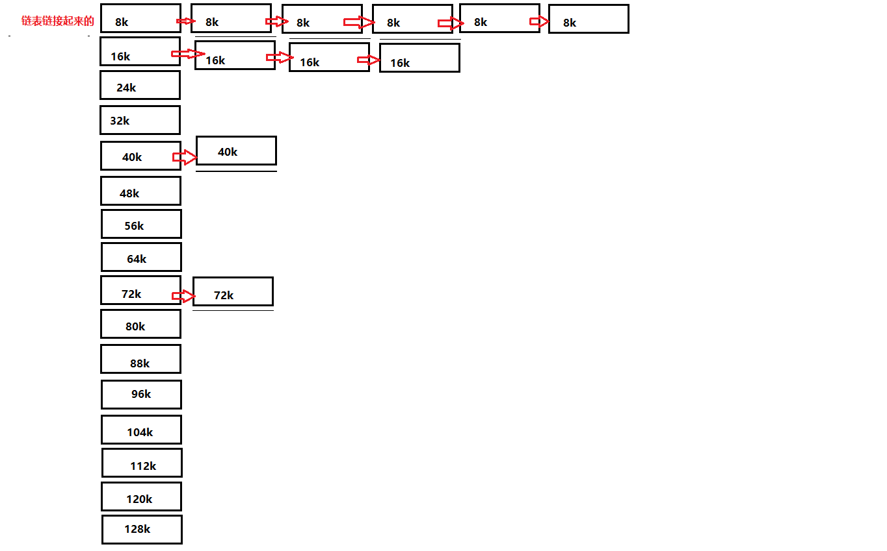

但是它分配内存块40k内存节点是分配20个，800k是给数组中下标4中的链表管理19个节点40k的内存，但是实际申请的1600k，还有800k留给内存池管理了，当你在申请内存32k，实际就会到内存池中拿出640k给数组下标3管理。

```c++
#ifndef CSTL_SOURCE_CALLOC_MEM_POOL_H
#define CSTL_SOURCE_CALLOC_MEM_POOL_H

#include "cmalloc_alloc.h"
#include <mutex>
namespace chen {

    union cnode_alloc_obj;
    union cnode_alloc_obj
    {
        union cnode_alloc_obj* free_list_link;
        char client_data[1]; // info address 
    };


    template <bool trheads, int inst>
    class calloc
    {
    public:
        // this one is needed for proper simple_alloc wrapping
        typedef char value_type;
        typedef cnode_alloc_obj obj;
    public:

        //内存对齐最小字节
        enum {__ALIGN = 8};
        // 内存池中最大内存节点 128
        enum {__MAX_BYTES = 128};
        // 内存
        enum {__NFREELISTS = __MAX_BYTES/__ALIGN};
    private:
        // 内存字节对齐 8的倍数
        static size_t  round_up(size_t bytes)
        {
            return ((bytes + __ALIGN -1) & ~(__ALIGN -1));
        }
        // 内存字节数组的下标 向上取整 33 -> 下标6 40
        static size_t free_list_index(size_t bytes)
        {
            return ((bytes + __ALIGN -1)/__ALIGN -1);//
        }
        //
        static void *refill(size_t n);

        static char * chunk_alloc(size_t size, int & nobjes);

        // Chunk allocation state.
        static char *start_free;
        static char *end_free;
        static size_t heap_size;
    public:
        /* n must be > 0      */
        static void * allocate(size_t n);
        /* p may not be 0 */
        static void deallocate(void *p, size_t n);
        static void * reallocate(void *p, size_t old_sz, size_t new_sz);
        static void show_info()
        {
            printf("mem_pool node size = %llu\n", (size_t)(end_free - start_free));
            printf("mem_pool use size = %llu\n", m_use_size);
            printf("mem_pool size = %llu\n", heap_size);
        }
    private :
        static obj *  free_list[__NFREELISTS];
        static  std::mutex m_lock;
        static size_t  m_use_size;
    };


    typedef calloc<false, 0 > csingle_client_alloc;
    typedef calloc<true, 0 >  cmultithreaded_alloc;


    template <bool threads, int inst>
    inline void * calloc<threads,inst>::allocate(size_t n)
    {
        obj **  my_free_list;
        obj *  result;

        m_use_size +=n;
        if (n > (size_t)__MAX_BYTES)
        {
            return(malloc_alloc::allocate(n));
        }
        printf("allocate index = %llu\n", free_list_index(n));
        my_free_list = free_list + free_list_index(n);
        // Acquire the lock here with a constructor call.
        // This ensures that it is released in exit or during stack
        // unwinding.
        /*REFERENCED*/
        if (threads)
        {
            m_lock.lock();
        }
        result = *my_free_list;
        if (result == 0)
        {
            void *r = refill(round_up(n));
            return r;
        }
        *my_free_list = result -> free_list_link;
        if (threads)
        {
            m_lock.unlock();
        }
        return (result);
    }
    template <bool threads, int inst>
    inline void calloc<threads, inst>::deallocate(void *p, size_t n)
    {
        obj *q = (obj *)p;
        obj  ** my_free_list;

        m_use_size -=n;
        if (n > (size_t)__MAX_BYTES)
        {

            malloc_alloc::deallocate(p, n);
            return;
        }
        printf("deallocate  index = %llu\n", free_list_index(n));
        my_free_list = free_list + free_list_index(n);
        // acquire lock

        if (threads)
        {
            m_lock.lock();
        }
        q->free_list_link = *my_free_list;
        *my_free_list = q;
        // lock is released here
        if (threads)
        {
            m_lock.unlock();
        }
    }


/* We allocate memory in large chunks in order to avoid fragmenting     */
/* the malloc heap too much.                                            */
/* We assume that size is properly aligned.                             */
/* We hold the allocation lock.                                         */
    template <bool threads, int inst>
    char* calloc<threads, inst>::chunk_alloc(size_t size, int& nobjs)
    {
        char * result;
        size_t total_bytes = size * nobjs;
        size_t bytes_left = end_free - start_free;

        if (bytes_left >= total_bytes)
        {
            result = start_free;
            start_free += total_bytes;
            return(result);
        }
        else if (bytes_left >= size)
        {
            nobjs = bytes_left/size;
            total_bytes = size * nobjs;
            result = start_free;
            start_free += total_bytes;
            return(result);
        }
        else
            {
                // 这边 heap_size  >> 4 ====> 扩容作准备的  内存池
            size_t bytes_to_get = 2 * total_bytes + round_up(heap_size >> 4);
            // Try to make use of the left-over piece.
            if (bytes_left > 0)
            {
                obj  ** my_free_list = free_list + free_list_index(bytes_left);

                ((obj *)start_free) -> free_list_link = *my_free_list;
                *my_free_list = (obj *)start_free;
            }
            start_free = (char *)malloc_alloc::allocate(bytes_to_get);
            if (0 == start_free)
            {
                int i;
                obj  ** my_free_list;
                obj *p;
                // Try to make do with what we have.  That can't
                // hurt.  We do not try smaller requests, since that tends
                // to result in disaster on multi-process machines.
                for (i = size; i <= __MAX_BYTES; i += __ALIGN)
                {
                    my_free_list = free_list + free_list_index(i);
                    p = *my_free_list;
                    if (0 != p)
                    {
                        *my_free_list = p -> free_list_link;
                        start_free = (char *)p;
                        end_free = start_free + i;
                        return(chunk_alloc(size, nobjs));
                        // Any leftover piece will eventually make it to the
                        // right free list.
                    }
                }
                end_free = 0;	// In case of exception.
                start_free = (char *)malloc_alloc::allocate(bytes_to_get);
                // This should either throw an
                // exception or remedy the situation.  Thus we assume it
                // succeeded.
            }
            heap_size += bytes_to_get;
            end_free = start_free + bytes_to_get;
            return(chunk_alloc(size, nobjs));
        }
    }

/* Returns an object of size n, and optionally adds to size n free list.*/
/* We assume that n is properly aligned.                                */
/* We hold the allocation lock.                                         */
    template <bool threads, int inst>
    void* calloc<threads, inst>::refill(size_t n)
    {
        int nobjs = 20;
        char * chunk = chunk_alloc(n, nobjs);
        obj  *  * my_free_list;
        obj * result;
        obj * current_obj, * next_obj;
        int i;

        if (1 == nobjs)
        {
            return(chunk);
        }
        my_free_list = free_list + free_list_index(n);

        /* Build free list in chunk */
        // node list -->>>>>>  8 * ? = 128
        result = (obj *)chunk;
        *my_free_list = next_obj = (obj *)(chunk + n);
        for (i = 1; ; i++)
        {
            current_obj = next_obj;
            next_obj = (obj *)((char *)next_obj + n);
            if (nobjs - 1 == i)
            {
                current_obj -> free_list_link = 0;
                break;
            }
            else
                {
                current_obj -> free_list_link = next_obj;
            }
        }
        return(result);
    }

    template <bool threads, int inst>
    void* calloc<threads, inst>::reallocate(void *p, size_t old_sz, size_t new_sz)
    {
        void * result;
        size_t copy_sz;

        if (old_sz > (size_t) __MAX_BYTES && new_sz > (size_t) __MAX_BYTES)
        {
            return(malloc_alloc::reallocate(p, old_sz, new_sz));
        }
        if (round_up(old_sz) == round_up(new_sz))
        {
            return(p);
        }
        result = allocate(new_sz);
        copy_sz = new_sz > old_sz? old_sz : new_sz;
        ::memcpy(result, p, copy_sz);
        deallocate(p, old_sz);
        return(result);
    }

    template <bool threads, int inst>
    char *calloc<threads, inst>::start_free = 0;

    template <bool threads, int inst>
    char *calloc<threads, inst>::end_free = 0;

    template <bool threads, int inst>
    size_t calloc<threads, inst>::heap_size = 0;
    template <bool threads, int inst>
    size_t calloc<threads, inst>::m_use_size = 0;
    template <bool threads, int inst>
    cnode_alloc_obj * calloc<threads, inst>::free_list[__NFREELISTS] = {0, 0, 0, 0, 0, 0, 0, 0, 0, 0, 0, 0, 0, 0, 0, 0};

}
#endif //CSTL_SOURCE_CALLOC_MEM_POOL_H
```

## 内存分配模型

### 重载new和delete操作的目的

C++提供的默认版本的new和delete运算符，无法在他们执行操作之前，对被操作的对象的数据成员执行一些自定义的逻辑操作，那么我们此时就要考虑重载C++中的new操作符和delete操作符，它们操作符可以全局重载，也可以在特定类中重载。

1. 可以在重载新的运算符功能中添加异常处理。
2. 希望自定义运算符delete，以用0覆盖被回收的堆内存块，以提高应用程序数据的安全性。
3. 重载new操作符可以在其内部定义C版本的malloc或realloc函数进行对象的堆内存分配，然而C++并不建议如此做，因为这样已经绕过了标准库中默认的内存分配器的内存管理机制。
4. 同理delete操作也可以在其重载版本中定义C版本的free()函数，同样C++不建议如此做。

new/delete操作符的作用域
- 如果使用某个类的成员函数来重载这些运算符，则意味着这些运算符仅针对该特定类才被重载。
- 如果重载是在类外完成的（即它不是类的成员函数），则只要您使用这些运算符（在任何地方）都将调用重载的“new”和“delete”。

以下是new操作符函数的原型：
```c++
void* operator new(size_t size);
```

以下是delete操作符函数的原型：delete操作符必须匹配一个void*类型的参数，函数返回的类型是void，并且默认情况下，重载后的new和delete操作符函数都是静态成员，因此在函数内部是无法使用this指针。
```c++
void operator delete(void*);
```
该函数接收一个必须删除的void*类型的参数，函数不应该返回任何东西。
默认情况下，重载的new和delete运算符函数都是静态成员，因此，他们无权访问this指针。

## 内存池

我们无法改变malloc的动作，这也意味着我们无法改变每次调用malloc都会产生额外开销，所以，我们去进行优化的方法就只能是减少对malloc的调用次数。

```c++
void* malloc(int size);
```

实现方法：
1. 在第一次分配内存时，调用malloc一次性分配一大块内存，称为内存池。
2. 当需要分配内存时，首先检查内存池是否有足够的容量，如果有就直接从内存池中为其分配内存，若不存在则调用malloc为内存池再补充一大块内存。
3. 当已经被分配出的内存释放时，将它归还于内存池。

如此，我们可以很简单的减少了malloc的调用次数，尽管每一次调用malloc都会产生额外的开销，但相比直接调用malloc会优化很多。

## 具体实现

```c++
class Screen {
public:
    Screen(int x) : i(x) {}
    int get() {return i;}

    void* operator new(size_t);
    void operator delete(void*, size_t);
private:
    Screen *next;//指向下一块可用内存
    static Screen* freeStore;//内存池头节点指针
    static const int screenChunk;//每次分配的数量
private:
    int i;
};
Screen* Screen::freeStore = 0;
const int Screen::screenChunk = 24;
```

首先分析这个类的定义：
1. 构造函数，数据成员i和方法get，这三个成员无关紧要。
2. 重载了new和delete，很明显我们要改变new行为就只能通过重载这两个函数。
3. 一个指向本体的指针：当当前成员还在内存池中时，用于连接下一块内存。
4. 一个指向内存池头节点的指针：指向所维护的内存池的第一个可用内存。
5. 一个代表每次分配的数量的int，也就是每次调用malloc所一次性分配的大小。

```c++
void* Screen::operator new(size_t size)
{
    Screen *p;
    if (!freeStore)
    {
        //当链表为空时， 申请内存
        size_t chunk = screenChunk * size; // 计算需要分配的大小
        //分配内存并将指针转型
        freeStore = p = reinterpret_cast<Screen*>(new char[chunk]);
        //将这一大片内存分割，当作链表串联起来
        for (; p!= &freeStore[screenChunk - 1]; ++p)
            p->next = p + 1;
        p->next = 0;//将整个内存池链表最后设为0
    }
    p = freeStore; //取出内存池开头的一块内存
    freeStore = freeStore->next;//头指针后移
    return p;
}
```

接着，我们分析对于内存分配的动作：
1. 当freeStore为空时，也就证明当前内存池为空，那么就分配一大块内存给内存池。
2. 分配之后，得到一大块内存用之前定义的next指针串联在一起，这样就完成了逻辑上的分割，虽然物理上它们可能是相连的，但是只要我们分配的时候使用next指针，就能保证一块一块的分配出去。
3. 当freeStore不为空时（本身就不为空或已经分配了内存），就取出内存池的第一块内存给p，并且将头指针后移，然后返回p。

这也就是我们得到的内存池，头节点由freeStore指向，尾节点的next为0；

```c++
//重载的delete方法
void Screen::operator delete(void* p, size_t)
{
    //将当前内存块的头指针指向可用内存链表的开头
    (static_cast<Screen*>(p))->next = freeStore;
    freeStore = static_cast<Screen*>(p);
}
```

当已经分配出去的内存使用结束被delete时，我们将他再次连接到内存池的开头，这样就完成了归还动作。

## 问题分析

基于上面的分配方式，可以发现几个缺陷：
1. 每个内存块都需要维护一个next指针，而这个指针只有当它在内存池中时才有用，离开内存池也是一个额外开销。
2. 对于每一种类，都需要重写一次。
3. 回收的内存仅仅归还于内存池，而没有归还于OS。

## Effective C++ 的实现

```c++
class Airplane {
private:
    struct AirplaneRep
    {
        //定义一个数据成员的结构体
        unsigned long miles;
        char type;
    };
private:
    union { //定义一个共用体，用来作为当前类的成员
        AirplaneRep rep;//当内存被分配时，将当前内存解释为AirplaneRep，作为数据成员使用
        Airplane *next;//当处于内存池中时，将当前内存解释为指针，指向下一个内存块
    };
public:
    unsigned long getMiles() {return rep.miles;}
    char getType() {return rep.type;}
    void set(unsigned long m, char t) {rep.miles = m; rep.type = t;}
public:
    static void *operator new(size_t size);
    static void operator delete(void *deadObject, size_t size);
private:
    static const int BLOCK_SIZE;//一次性分配的内存
    static Airplane* headOfFreeList;//内存池头节点指针
};
Airplane* Airplane::headOfFreeList;
const int Airplane::BLOCK_SIZE = 512;
```

我们仍然先来看对类的定义，在上一种定义中，使用了一个指针和一个数据成员，这就意味着需要分配一个数据成员+一个指针的内存空间，但当使用时，指针的空间并没有被使用。在当前定义中，使用一个共用体，只分配一个数据成员的空间，当他在内存池中时，将该空间视为指针；当他被分配后，将该空间视为数据成员。

当我们将内存分配出去之后，使用者不知道也不必知道这块内存曾经被解释为指针，他会从头开始复写内存块中的内存，这样就为每一块内存空间省下来一个指针的空间。

```c++
void* Airplane::operator new(size_t size)
{
    //若所需要分配的大小有误时，就转交给::operator new()
    if (size != sizeof(Airplane))
    {
        return ::operator new(size);
    }

    Airplane *p = headOfFreeList;
    if (p)
    {
        //如果内存池不为空，就将头指针后移
        headOfFreeList = p->next;
    } else
    {
        //若内存池为空
        Airplane *newBlock = static_cast<Airplane*>(::operator new((BLOCK_SIZE) * sizeof(Airplane)));
        //将他分割成小块，连接成链表
        //但跳过0，将他作为本次分配的结果交付
        for (int i = 1; i < BLOCK_SIZE - 1; i++)
        {
            newBlock[i].next = &newBlock[i + 1];
        }
        newBlock[BLOCK_SIZE - 1].next = 0;
        p = newBlock;
        headOfFreeList = &newBlock[1];
    }
    return p;
}
```
这里的operator new()所做的事情和上一个相同，但是为什么要考虑需要分配的内存会不等于当前类的大小呢？当发生继承时。

```c++
void Airplane::operator delete(void *deadObject, size_t size)
{
    if (deadObject == 0) return;
    if (size != sizeof(Airplane))
    {
        ::operator delete(deadObject);
        return;
    }
    Airplane *carcass = static_cast<Airplane*>(deadObject);
    carcass->next = headOfFreeList;
    headOfFreeList = carcass;
}
```

## 问题分析

这种实现方式解决了对指针空间的利用，但是释放的时候仍然没有将空间归还给OS，也没有解决对每一种类都得去重写一遍代码的问题。

## 实现内存分配重载在多个类中的复用

```c++
class myAllocator {
public:
    void* allocate(size_t);//分配内存
    void deallocate(void*, size_t);//回收内存
private:
    struct obj {
        struct obj* next;
    };
    obj* freeStore = nullptr;//指向内存池的可用位置的第一个位置
    const int CHUNK = 5;//每次分配的大小
};
void* myAllocator::allocate(size_t size)
{
    obj* p;
    if (!freeStore)
    {
        //当链表为空
        size_t chunk = CHUNK * size;
        freeStore = p = (obj*)malloc(chunk); //分配内存
        //将其分割成链表
        for (int i = 0; i < CHUNK - 1; i++)
        {
            p->next = (obj*)((char*)p + size);
            p = p->next;
        }
        p->next = nullptr;
    }
    p = freeStore;
    freeStore = freeStore->next;
    return p;
}
void myAllocator::deallocate(void* p, size_t size)
{
    //回收内存
    ((obj*)p)->next = freeStore;
    freeStore = ((obj*)p);
}
```
使用方法举例：

```c++
class foo {
public:
    foo(int i) : x(i), y(i) {}
    int x;
    int y;
    static myAllocator myAlloc;// 内存分配器

    static void *operator new(size_t size)
    {
        return myAlloc.allocate(size);
    }
    static void operator delete(void* loc, size_t size)
    {
        return myAlloc.deallocate(loc, size);
    }
};
```

## 问题分析

上面三种方法最后也没有解决回收的内存没有归还于OS，而是单纯在内存池中。

那是否可以解决呢？

首先在归还内存块的时候，并不会按照顺序归还，所以在内存链表中，内存块之间的连接是混乱的，我们无法有效的找到一个方法去判断相连的内存是否已经全部被归还。

同时由于分配出的内存块已经排除了cookie，而编辑器调用free去归还内存的动作也依赖于cookie，所以也没有办法在归还时直接调用free。

此外，由于链表的多次连接与分配，我们已经不能找到最开始分配内存时所用的指针，所以，即使我们知道了全部的内存空间都已经归还至了内存池，也无法找到最开始的那根指针而对其使用free。


# SGI STL 特殊配置器（std::alloc）

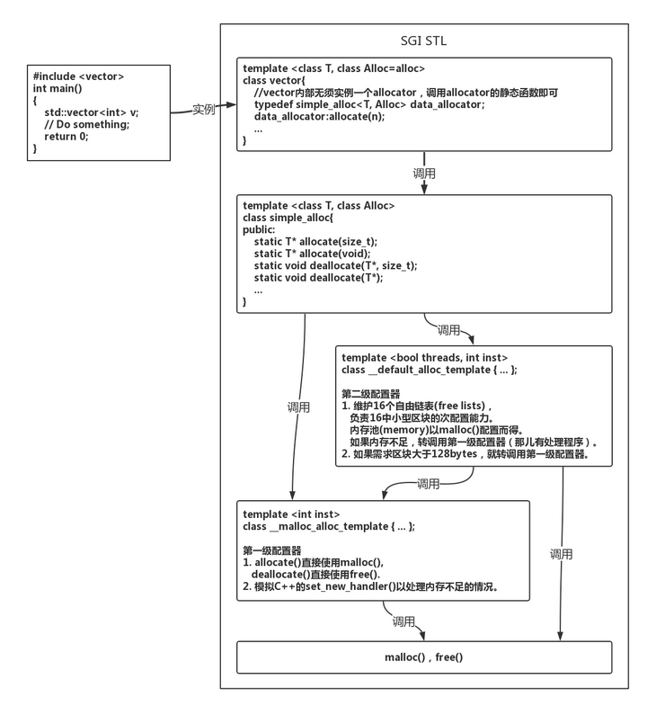

```c++
template<class T, class Alloc>
class simple_alloc 
{
public:
    static T* allocate(std::size_t n)
    {
        return 0==n ? 0 : (T*)Alloc::allocate(n * sizeof(T));
    }
    static T* allocate(void)
    {
        return (T*)Alloc::allocate(sizeof(T));
    }
    static void deallocate(T* p, size_t n)
    {
        if (n != 0)
        {
            Alloc::deallocate(p, n * sizeof(T));
        }
    }

    static void deallocate(T* p)
    {
        Alloc::deallocate(p, sizeof(T));
    }
};
```

# 序列式容器

## vector

```c++
template <class T, class Alloc = alloc>
class vector {
public:
   // 定义 vector 自身的嵌套型别
    typedef T value_type;
    typedef value_type* pointer;
    typedef const value_type* const_pointer;
    // 定义迭代器, 这里就只是一个普通的指针
    typedef value_type* iterator;
    typedef const value_type* const_iterator;
    typedef value_type& reference;
    typedef const value_type& const_reference;
    typedef size_t size_type;
    typedef ptrdiff_t difference_type;
    ...
  protected:
    typedef simple_alloc<value_type, Alloc> data_allocator; // 设置其空间配置器
    iterator start;    // 当前使用空间的头
    iterator finish;   // 当前使用空间的尾
    iterator end_of_storage; // 当前可用空间的尾
    ...
};
```

因为vector需要表示用户操作的当前数据的起始地址，结束地址，还需要某真正的最大地址。所以总共需要3个迭代器分别指向：数据的头（start），数据的尾（finish），数组的尾（end_of_storage）。

### 构造函数

vector有多个构造函数，为了满足多种初始化

```c++
vector(): start(0), finish(0), end_of_storage(0) {} //默认构造函数
explicit vector(size_type n) {fill_initialize(n, T());} // explicit说明必须显示调用。
vector(size_type n, const T& value) {fill_initialize(n, value);} //接受一个大小和初始化值，int 和 long都执行相同的函数初始化
vector(int n, const T& value) {fill_initialize(n, value);}
vector(long n, const T& value) {fill_initialize(n, value);}
vector(const vector<T, Alloc>& x);// 接受一个vector参数的构造函数

void fill_initialize(size_type n, const T& value)
{
    start = allocate_and_fill(n, value); //初始化并赋初始值
    finish = start + n;
    end_of_storage = finish;
}

iterator allocate_and_fill(size_type n, const T& x)
{
    iterator result = data_allocator::allocate(n);// 申请n个元素的空间
    __STL_TRY // 对整个线性空间进行初始化，如果有一个失败则删除全部空间并抛出异常
    {
        uninitialized_fill_n(result, n, x);
        return result;
    }
    __STL_UNWIND(data_allocator::deallocate(result, n));
}
```

我们看到，这里面，初始化满足要么都初始化成功，要么一个都不初始化并释放掉然后抛出异常。

因为vector是一种class template，所以我们不需要手动的释放内存，生命周期结束后就自动调用析构从而释放调用空间，当然我们也可以直接调用析构函数释放内存。

```c++
void deallocate()
{
    if (start)
    {
        data_allocator::deallocate(start, end_of_storage - start);
    }
}
~vector()
{
    destroy(start, finish);
    deallocate();
}
```

### 属性获取

下面的部分就涉及到了位置参数的获取，比如返回vector的开始和结尾，返回最后一个元素，返回当前元素个数，元素容量，是否为空等。

这里需要注意的是因为end()返回的是finish，而finish是指向最后一个元素的后一个位置的指针，即`[start, end)`。
```c++
public:
    iterator begin() {return start;}
    iterator end() {return finish;}
    reference front() {return *begin();}
    reference back() {return *(end() - 1);}
    const_iterator begin() const {return start;}//获取右值
    const_iterator end() const {return finish;}

    const_reference front() const {return *begin();}
    const_reference back() const {return *(end() - 1);}

    size_type size() const {return size_type(end() - begin());}
    size_type max_size() const {return size_type(-1) / sizeof(T);}
    size_type capacity() const {return size_type(end_of_storage - begin());}// 实际大小
    bool empty() const {return begin() == end();}
```
### push and pop

vector的push和pop操作都只对尾部进行操作。

当调用push_back插入新元素的时候，首先会检查是否有备用空间，如果有就直接在备用空间上构造元素，并调整finish即可。当没有备用空间，就扩充空间。

```c++
void push_back(const T& x)
{
    if (finish != end_of_storage)
    {
        construct(finish, x);
        ++finish;
    } else
    {
        insert_aux(end(), x);
    }
}

#include<new.h>
template<class T1, class T2>
inline void construct(T1 *p, const T2& value)
{
    new (p) T1(value);
}

template<class T, class Alloc>
void vector<T, Alloc>::insert_aux(iterator position, const T& x)
{
    if (finish != end_of_storage)
    {
        construct(finish, *(finish - 1));
        ++finish;
        T x_copy = x;
        copy_backward(position, finish - 2, finish - 1);
        *position = x_copy;
    } else
    {
        const size_type old_size = size();
        const size_type len = old_size != 0 ? 2 * old_size : 1;
        iterator new_start = data_allocator::allocate(len);//分配len的空间
        iterator new_finish = new_start;
        try
        {
            //将原来的vector内容拷贝到新的vector
            //拷贝安插点后的内容，因为也可能被insert(p,x)调用
            new_finish = uninitialized_copy(start, position, new_start);
            construct(new_finish, x);
            ++new_finish;
            new_finish = unintialized_copy(position, finish, new_finish);
        } catch(const std::exception& e)
        {
            destroy(new_start, new_finish);
            data_allocator::deallocate(new_start, len);
            throw;
        }
        // 构造并释放原空间
        destroy(begin(), end());
        deallocate();
        // 调整迭代器指向新的位置
        start = new_start;
        finish = new_finish;
        end_of_storage = new_start + len;
    }
}
```

pop元素
```c++
public:
    void pop_back()
    {
        --finish;
        destory(finish);
    }
```

erase删除元素，函数清除指定位置的元素，并重载函数用于清除一个范围内的元素，实际实现就是将删除元素后面的所有元素向前移动，时间开销比较大，所以vector并不适合频繁的删除操作（除去队尾删除）。

```c++
// [first, last)
iterator erase(iterator first, iterator last)
{
    iterator i = copy(last, finish, first);
    destroy(i, finish);
    finish = finish - (last - first);
    return first;
}

iterator erase(iterator position)
{
    if (position + 1 != end())
    {
        copy(position + 1, finish, position); //拷贝 [position + 1, finish)的元素到position
    }
    // 如果 position就是最后一个元素，则直接删除即可不需要拷贝
    --finish;
    destroy(finish);
    return position;
}

void clear()
{
    erase(begin(), end());
}
```
清除范围内的元素，第一步要将`[last, finish)`的元素拷贝到first位置，然后清除`[i, finish)`，此i为拷贝过后的尾部迭代器。

insert插入元素，分了3种情况：
1. 如果备用空间足够且插入点后的现有元素多于新增元素；
2. 如果备用空间足够且插入点后的现有元素小于新增元素；
3. 如果备用空间不够。

插入点之后的现有元素>新增元素个数

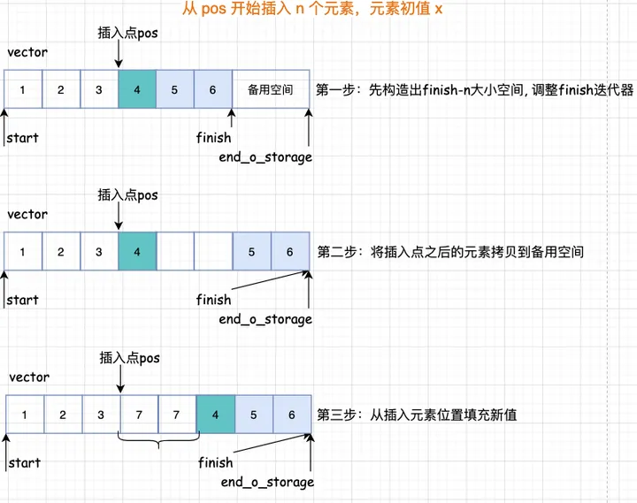

插入点之后的现有元素个数<=新增元素个数

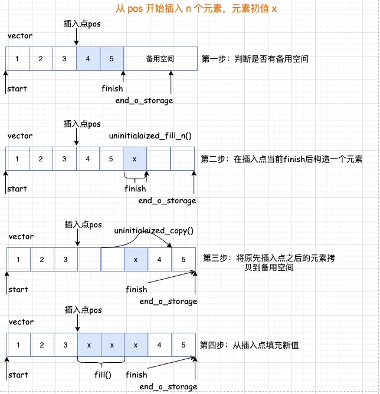

如果备用空间不足

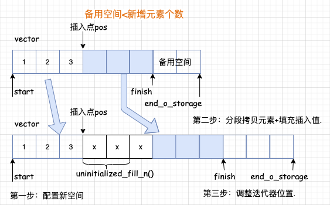

上面可能会发生迭代器失效问题，所谓的迭代器失效问题是由于元素空间重新配置导致之前的迭代器访问的元素不在了，总结来说有2种：
1. 由于插入元素，使得容器元素整体迁移导致存放原容器元素的空间不再有效，从而使得指向原空间的迭代器失效。
2. 由于删除元素，使得某些元素次序变化导致原本指向某元素的迭代器不再指向期望指向的元素。

- `copy(a, b, c)`：将`[a,b)`之间的元素拷贝到`(c, c-(b-a))`位置。**适用目标位置已经初始化**
```c++
template<class InputIterator, class OutputIterator>
OutputIterator copy(
    InputIterator first, 
    InputIterator last, 
    OutputIterator result)
{
    while (first != last)
    {
        *result = *first;
        ++result;
        ++first;
    }
    return result;
}
```
- `uninitialized_copy(first, last, result)`：具体作用是将`[first,last)`内的元素拷贝到`result`从前往后拷贝，会调用construct函数。**适用目标位置没有初始化**
```c++
template<class InputIterator, class ForwardIterator>
inline ForwardIterator uninitialized_copy(
    InputIterator first,
    InputIterator last,
    ForwardIterator result
)
{
    return __uninitialized_copy(
        first, last, result, 
        value_type(result));
}
```

- `copy_backward(first,last,result)`：将`[first,last)`内的元素拷贝到`result`从后往前拷贝
```c++
template<class BidireactionalIterator1, 
class BidirectionalIterator2>
BidirectionalIterator2 copy_backward(
    BidirectionalIterator1 first,
    BidirectionalIterator1 last,
    BidirectionalIterator2 result)
{
    while (last != first)
    {
        *(--result) = *(--last);
    }
    return result;
}
```

## list

list是一种双向链表。
每次插入或删除一个元素，就配置或释放一个元素，都是常数级时间复杂度。
list源码分为两部分，一部分是list结构，一部分是list节点的结构。

__list_node用来实现节点，数据结构中就储存前后指针和属性
```c++
template<class T> struct __list_node {
    //前后指针
    typedef void* void_pointer; //无类型指针
    void_pointer next;
    void_pointer prev;
    //属性
    T data;
};
```

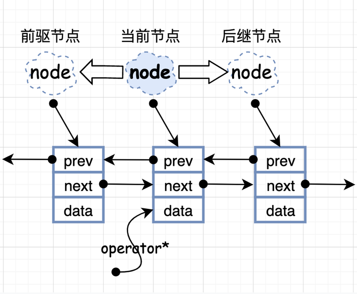

基本类型

```c++
template<class T, class Ref, class Ptr> struct __list_iterator {
    typedef __list_iterator<T, T&, T*> iterator;// 迭代器
    typedef __list_iterator<T, const T&, const T*> const_iterator;
    typedef __list_iterator<T, Ref, Ptr> self;

    //迭代器是bidirectional_iterator_tag类型
    typedef bidirectional_itertator_tag iterator_category;
    typedef T value_type;
    typedef Ptr pointer;
    typedef Ref reference;
    typedef size_t size_type;
    typedef ptrdiff_t difference_type;
    ...
};
```
### 构造函数

```c++
template<class T, class Ref, class Ptr> struct __list_iterator {
    typedef __list_node<T>* link_type;//定义节点指针
    link_type node;

    __list_iterator(link_type x) : node(x) {}
    __list_iterator() {}
    __list_iterator(const iterator& x) : node(x.node) {}
    ...
};
```

### 重载

```c++
template<class T, class Ref, class Ptr> struct __list_iterator {
    ...
    //重载
    bool operator==(const self& x) const {return node == x.node;}
    bool operator!=(const self& x) const {return node != x.node;}
    ...
    //++和--是直接操作的指针指向next还是prev，因为list是一个双向链表
    self& operator++()
    {
        node = (link_type)((*node).next);
        return *this;
    }

    self operator++(int)
    {
        self tmp = *this;
        ++*this;
        return tmp;
    }

    self& operator--()
    {
        node = (link_type)((*node).prev);
        return *this;
    }

    self operator--(int)
    {
        self tmp = *this;
        --*this;
        return tmp;
    } 
};

```

### list结构

list自己定义了嵌套类型满足traits编程，list迭代器是bidirectional_iterator_tag类型，并不是一个普通的指针。

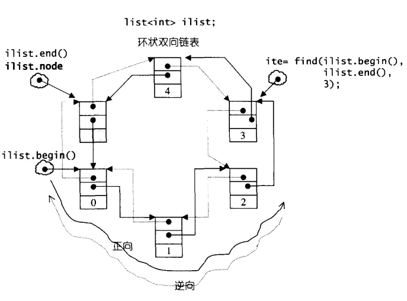

list在定义node节点时，定义的不是一个指针。
```c++
template<class T, class Alloc = alloc>
class list {
protected:
    typedef void* void_pointer;
    typedef __list_node<T> list_node;//节点
    typedef simple_alloc<list_node,Alloc> list_node_allocator;//空间配置
public:
    //定义嵌套类型
    typedef T value_type;
    typedef value_type* pointer;
    typedef const value_type* const_pointer;
    typedef value_type& reference;
    typedef const value_type& const_reference;
    typedef list_node* link_type;
    typedef size_t size_type;
    typedef ptrdiff_t difference_type;
protected:
    //定义一个节点
    link_type node;
public:
    //定义迭代器
    typedef __list_iterator<T, T&, T*> itertaor;
    typedef __list_iterator<T,const T&, const T*> const_iterator;
    ...
};
```

### list构造和析构函数

每个构造函数都会创造一个空的node节点，为了保证我们在执行任何操作都不会修改迭代器。

list默认使用alloc作为空间配置器，并根据这个另外定义了一个list_node_allocator，目的是为了更加方便以节点大小来配置单元。

```c++
template<class T, class Alloc=alloc>
class list{
protected:
    typedef void* void_pointer;
    typedef __list_node<T> list_node;
    typedef simple_alloc<list_node, Alloc> list_node_allocator;//空间配置
};
```
其中，list_node_allocator(n)表示配置n个节点空间。以下4个函数，分别用来配置，释放，构造，销毁一个节点。
```c++
class list{
protected:
    //配置一个节点并返回
    link_type get_node() {return list_node_allocator::allocate();}
    //释放一个节点
    void put_node(link_type p) {list_node_allocator::deallorcate(p);}
    //产生（配置并构造）一个节点带有元素初始值
    link_type create_node(const T& x)
    {
        link_type p = get_node();
        __STL_TRY {
            construct(&p->data, x);
        }
        __STL_UNWIND(put_node(p));
        return p;
    }
    //销毁
    void destroy_node(link_type p)
    {
        destroy(&p->data);
        put_node(p);
    }
    //初始化节点
    void empty_initialize()
    {
        node = get_node();
        node->next = node;
        node->prev = node;
    }
};

```
### 基本属性获取

```c++
template<class T, class Alloc = alloc>
class list
{
    ...
public:
    iterator begin() {return (link_type)((*node).next);}//返回指向头的指针
    const_iterator begin() const {return (link_type)((*node).next);}
    iterator end() {return node;}//返回最后一个元素的后一个指针
    const_iterator end() const {return node;}

    //这里是为旋转做准备，rbegin返回最后一个地址，rend返回第一个地址，
    reverse_iterator rbegin() {return reverse_iterator(end());}
    const_reverse_iterator rbegin() const {
        return const_reverse_iterator(end());
    }
    reverse_iterator rend() {return reverse_iterator(begin());}
    const_reverse_iterator rend() const {
        return const_reverse_iterator(begin());
    }

    //判断是否为空链表
    bool empty() const {return node->next == node;}
    //因为这个链表，地址并不连续，所以要自己迭代计算链表长度
    size_type size() const {
        size_type result = 0;
        distance(begin(), end(), result);
        return result;
    }
    size_type max_size() const {return size_type(-1);}
    //返回第一个元素值
    reference front() {return *begin();}
    const_reference front() const {return *begin();}
    //返回最后一个元素的值
    reference back() {return *(--end());}
    const_reference back() const {return *(--end());}
    
    //交换
    void swap(list<T, Alloc>& x) {__STD::swap(node, x.node);}
    ...
};
```
### list的头插和尾插

因为list是一个循环的双链表，所以push和pop就必须实现头和尾的操作。

在list中，push操作都调用insert函数，pop操作都调用erase函数
```c++
template<class T, class Alloc=alloc>
class list {
    ...
    void push_front(const T& x) {insert(begin(), x);}
    void push_back(const T& x) {insert(end(), x);}
    
    void pop_front() {erase(begin());}
    void pop_back()
    {
        iterator tmp = end();
        erase(--tmp);
    }
    ...
};
```

上面两个插入函数内部调用insert函数
```c++
class list {
    ...
public:
    iterator insert(iterator position, const T& x)
    {
        //将元素插入指定位置的前一个位置
        link_type tmp = create_node(x);
        tmp->next = position.node;
        tmp->prev = position.node->prev;
        (link_type(position.node->prev))->next = tmp;
        position.node->prev = tmp;
        return tmp;
    }
};
```
这里要注意：节点实际是从node空节点开始的。插入操作是将元素插入到指定位置的前一个位置进行插入的。

删除元素的操作大都是由erase函数来实现的，其他的所有函数都是直接或间接调用erase。list是链表，所以链表怎么实现删除，list就在怎么操作，先保留前驱和后继节点，再调整指针位置即可，由于它是双向环状链表，只要处理好边界条件，那么在头和尾的操作几乎一样。
```c++
template<class T, class Alloc = alloc>
class list
{
...
    iterator erase(iterator first, iterator last);
    void clear();
    iterator erase(iterator position)
    {
        link_type next_node = link_type(position.node->next);
        link_type prev_node = link_type(position.node->prev);
        prev_node->next = next_node;
        next_node->prev = prev_node;
        destroy_node(position.node);
        return iterator(next_node);
    }
};

```

## deque

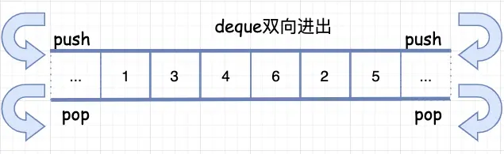

上面就是deque的示例图，deque和vector的最大差异在于deque允许常数时间内对头端或尾端进行元素的插入和移除操作。

二在于deque没有所谓的容量概念，因为它是动态地以分段连续空间组合而成随时可以增加一块新的空间拼接起来。

虽然deque也提供了随机访问迭代器，但是它的迭代器和前面两种都不一样，其设计比较复杂，因此会对各种运算产生一定的影响，除非必要尽可能选择使用vector而非deque。

### deque的中控器

deque在逻辑上看起来是连续空间，内部是由一段一段的定量连续空间构成。一旦有必要在deque的前端或尾端增加新空间，便配置一定量的连续空间，串接在整个deque的头部或尾部。

而这最大的挑战就是在这些分段的定量连续空间上，维护其逻辑上的整体连续，并提供随机存取的接口，从而避开像vector那样的“重新配置-赋值-释放”，这样一来虽然开销降低，但是也提高了复杂的迭代器结构。

因此数据结构的设计和迭代器前进和后退等操作都非常复杂。

deque采用一块所谓的map（不是map容器）作为中控器，其实就是一小块连续空间，其中每个元素都是指针，指向另外一段较大的连续线性空间，称之为**缓冲区**。在后面我们看到，缓冲区才是deque的存储空间主体。

```c++
#ifndef __STL_NON_TYPE_TMPL_PARAM_BUG
template<class T, class Ref, class Ptr, size_t BufSiz>
class deque {
public:
    typedef T value_type;
    typedef value_type* pointer;
    ...
protected:
    typedef pointer** map_pointer;
    map_pointer map;
    size_type map_size;
    ...
};

```

其示例图如下：deque的结构设计中，map和node-buffer的关系如下
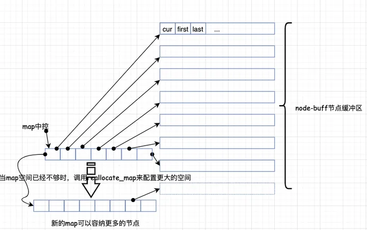

### deque的迭代器

deque是分段连续空间，维持其逻辑“整体连续”的任务，就靠它的迭代器来实现，也就是`operator++`和`operator--`两个运算上面。

我们可以思考一下，如果让你来设计，你觉得deque的迭代器应该具备什么样的结构和功能呢？

首先第一点，我们能想到的是，既然是分段连续，那么迭代器应该能够指出当前的连续空间在哪里；

其次，第二点因为缓冲区有边界，迭代器还应该要能判断，当前是否处于所在缓冲区的边缘，如果是，一旦前进或后退，就必须跳转到上一个或下一个缓冲区；

第三点，也即是实现前面两种情况的前提下，迭代器必须能随时控制中控器。

```c++
template<class T, class Ref, class Ptr, size_t BufSiz>
struct __deque_iterator {
    //迭代器定义
    typedef __deque_iterator<T, T&, T*, BufSiz> iterator;
    typedef __deque_iterator<T, const T&, const T*, BufSiz> const_iterator;
    static size_t buffer_size() 
    {return __deque_buf_size(BufSiz, sizeof(T));}
    //deque是random_access_iterator_tag类型 即随机访问迭代器
    typedef random_access_iterator_tag iterator_category;
    //基本类型的定义，满足traits编程
    typedef T value_type;
    typedef Ptr pointer;
    typedef Ref reference;
    typedef size_t size_type;
    typedef ptrdiff_t difference_type;//指针之间距离
    //node
    typedef T** map_pointer;
    map_pointer node;
    typedef __deque_iterator self;
    ...
};
```

deque的每一个缓冲区设计了三个迭代器（为什么呢）
```c++
struct __deque_iterator {
    ...
    typedef T value_type;
    T* cur;
    T* first;
    T* last;
    typedef T** map_pointer;
    map_pointer node;
    ...
};
```
回到之前所说的，因为它是分段连续的空间，下图描绘了deque的中控器，缓冲区，迭代器之间的相互关系。

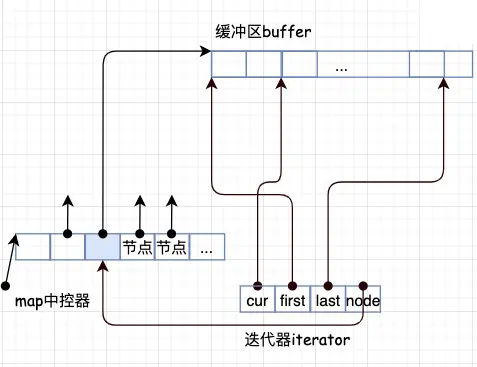

如图，每一段都指向一个缓冲区buffer，而缓冲区是需要知道每个元素的位置的，所以需要这些迭代器去访问。

其中cur表示当前所指位置，first表示当前数组中头部位置，last表示尾部位置。

这样就方便管理很多，需要注意deque的空间是由map管理的，它是一个指向指针的指针，所以三个参数都是指向当前的数组，但这样的数组可能有多个，只是每个数组都管理这3个变量。

那么，缓冲区的大小是谁来决定的呢？用来决定缓冲区大小的是一个全局函数。

```c++
inline size_t __deque_buf_size(size_t n, size_t sz) {
    return n!=0 ? n : (sz < 512 ? size_t(512 / sz) : size_t(1));
}
// 如果 n 不为 0 则返回n，表示缓冲区大小由用户自定义
// 如果 n == 0 表示缓冲区大小默认值
// 如果 sz = （元素大小sizeof(value_type)）小于 512 则返回 512/sz
// 如果 sz 不小于512 则返回 1
```
假设我们现在构造了一个int类型的deque，设置缓冲区大小等于32，这样一来，每个缓冲区可以容纳32/sizeof(int)=8个元素，经过一番操作后，deque现在有了20个元素了，那么成员函数begin()和end()返回的两个迭代器该是怎么样的呢？

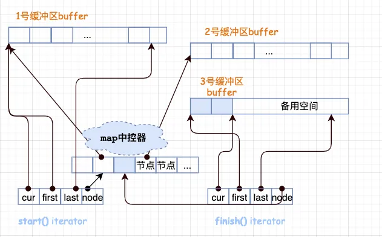

20个元素需要20/8 = 3个缓冲区，所以map运用了3个节点，迭代器start内的cur指针指向缓冲区第一个元素，迭代器finish内的cur指针指向缓冲区的最后一个元素（的下一个位置）。

注意，最后一个缓冲区尚有备用空间，如果之后还有新元素插入，则直接插入到备用空间。

### deque迭代器的操作

前进和后退

`operator++`操作代表是需要切换到下一个元素，这里需要先切换再判断是否已经到达缓冲区的末尾。

```c++
self& operator++() {
    ++cur; //切换到下一个元素
    if (cur == last) { //如果已经到达所在缓冲区的末尾
        set_node(node+1);//切换下一个节点
        cur = first;
    }
    return *this;
};
```

`operator--`操作代表切换到上一个元素所在的位置，需要先判断是否到达缓冲区的头部。
```c++
self& operator--() {
    if (cur == first)
    {
        set_node(node - 1);
        cur = last;
    }
    --cur;
    return *this;
}
```

### deque的构造和析构函数

构造函数，有多个重载函数，接受大部分不同的参数类型，基本上每一个构造函数都会调用`create_map_and_nodes`，这就是构造函数的核心。

```c++
template<class T, class Alloc = alloc, size_t BufSiz = 0>
class deque {
    ...
public:
    deque() : start(), finish(), map(0), map_size(0) {
        create_map_and_nodes(0);
    }//默认构造函数
    deque(const deque& x) :start(), finish(), map(0),  map_size(0) {
        create_map_and_nodes(x.size());
        __STL_TRY {
            uninitialized_copy(x.begin(), x.end(), start);
        }
        __STL_UNWIND(destroy_map_and_nodes());
    }
    //接受n:初始化大小，value初始化的值
    deque(size_type n, const value_type& value): start(), finish(), map(0), map_size(0) {
        fill_initialize(n, value);
    }
    deque(int n, const value_type& value): start(), finish(), map(0), map_size(0) {
        fill_initialize(n, value);
    }
    deque(long n, const value_type& value): start(), finish(), map(0), map_size(0) {
        fill_initialize(n, value);
    }
    ...
};
```

下面我们来学习一下deque的中控器是如何配置的

```c++
void deque<T, Alloc, BufSize>::create_map_and_nodes(
    size_type num_elements) 
{
    //需要节点数=(每个元素/每个缓冲区可容纳元素个数+1)
    //如果正好整除，多配一个节点
    size_type num_nodes = num_elements / buffer_size() + 1;
    //一个map要管理几个节点，最少8个，最多是需要节点数+2
    map_size = max(initial_map_size(), num_nodes + 2);
    map = map_allocator::allocate(map_size);
    //计算出数组的头前面留出来的位置保存并在nstart
    map_pointer nstart = map + (map_size - num_nodes) / 2;
    map_pointer nfinish = nstart + num_nodes - 1;
    map_pointer cur;//指向所拥有大的节点的最中央位置
    ...
}

```
注意看，deque的begin和end不是一开始就指向map中控器里开始和结尾的，**而是指向所拥有的节点最中央的位置。**

这样带来的好处是可以使得头尾两边扩充的可能性一样大，换句话说，因为deque是头尾插入删除都是O(1)所以deque再头和尾都留有空间方便头尾插入。

那么，什么时候map中控器本身需要调整大小呢？触发条件在于`reverse_map_at_back`和`reverse_map_at_front`这两个函数来判断，实际操作由`reallocate_map`来执行

那么`reallocate_map`又是如何操作的呢？

```c++
// 如果map尾端的节点备用空间不足，符合条件就配置一个新的map(配置更大的，拷贝原来的，释放原来的)
void reverse_map_at_back(size_type nodes_to_add = 1)
{
    if (nodes_to_add + 1 > map_size - (finish.node - map))
    {
        reallocate_map(nodes_to_add, false);
    }
}
// 如果map前端的节点备用空间不足，符合条件就配置一个新的map（配置更大的，拷贝原来的，释放原来的）
void reverse_map_at_front(size_type nodes_to_add = 1)
{
    if (nodes_to_add > start.node - map)
    {
        reallocate_map(nodes_to_add, true);
    }
}
```

### deque的插入元素和删除元素

因为deque的是能够双向操作，所以其push和pop操作都类似于list都可以直接有对应的操作，需要注意的是list是链表，并不会涉及到界线的判断，而deque是由数组来存储的，就需要对边界判断。

push实现

```c++
template<class T, class Alloc = alloc, size_t BufSiz = 0>
class deque {
    ...
public:
    //对尾进行插入
    //判断函数是否达到了数组尾部，没有达到就直接进行插入
    void push_back(const value_type& t)
    {
        if (finish.cur != finish.last - 1)
        {
            construct(finish.cur, t);
            ++finish.cur;
        } else
        {
            push_back_aux(t);
        }
    }
    //对头进行插入
    //判断函数是否达到了数组头部，没有达到就直接进行插入
    void push_front(const value_type& t)
    {
        if (start.cur != start.first)
        {
            construct(start.cur - 1, t);
            --start.cur;
        } else
        {
            push_front_aux(t);
        }
    }
    ...
};
```

pop实现

```c++
template<class T, class Alloc = alloc, size_t BufSize = 0>
class deque {
    ...
public:
    //对尾部进行操作
    // 判断是否达到数组的头部，没有就直接释放
    void pop_back() {
        if (finish.cur != finish.first)
        {
            --finish.cur;
            destory(finish.cur);
        } else
        {
            pop_back_aux();
        }
    }
    //对头部进行操作
    //判断是否达到数组的尾部，没有达到就直接释放
    void pop_front()
    {
        if (start.cur != start.last - 1)
        {
            destroy(start.cur);
            ++start.cur;
        } else
        {
            pop_front_aux();
        }
    }
    ...
};
```

`reverse_map_at`一类函数，pop和push都先调用了`reverse_map_at_XX`函数，这些函数主要是为了判断前后空间是否足够。

### 删除操作

不知道还记得，最开始构造函数调用`create_map_and_nodes`函数，考虑到deque实现前后插入时间复杂度为O(1)，保证了在前后留出了空间，所以push和pop都可以在前面的数组进行操作。

现在就来看erase，因为deque是由数组构成，所以地址空间是连续的，删除也就像vector一样，要移动所有的元素。

deque为了保证效率尽可能的高，就判断删除的位置是中间偏后还是中间偏前来进行移动。

```c++
template<class T, class Alloc = alloc, size_t BufSiz = 0>
class deque {
    ...
public:
    iterator erase(iterator pos)
    {
        iterator next = pos;
        ++next;
        difference_type index = pos - start;
        //删除的是中间偏前，移动前面的元素
        if (index < (size() >> 1))
        {
            copy_backward(start, pos, next);
            pop_front();
        }
        //删除的地方是中间偏后，移动后面的元素
        else
        {
            copy(next, finish, pos);
            pop_back();
        }
        return start + index;
    }
    // 范围删除，实际上也是调用上面的erase函数。
    iterator erase(iterator first, iterator last);
    void clear();
    ...
};
```

最后是insert函数，deque源码的基本每一个insert重载函数都会调用了insert_auto判断插入的位置离头还是尾比较近

如果离头近：则先将头往前移动，调整将要移动的距离，用copy进行调整。

如果离尾近：则将尾往前移动，调整将要移动的距离，用copy进行调整。

### 以deque为底层容器的适配器

- 栈stack
- 队列queue
- 优先队列priority_queue以vector为容器，heap为数据操作的配置器

# 关联式容器