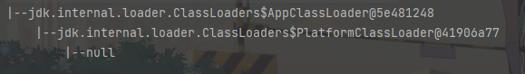
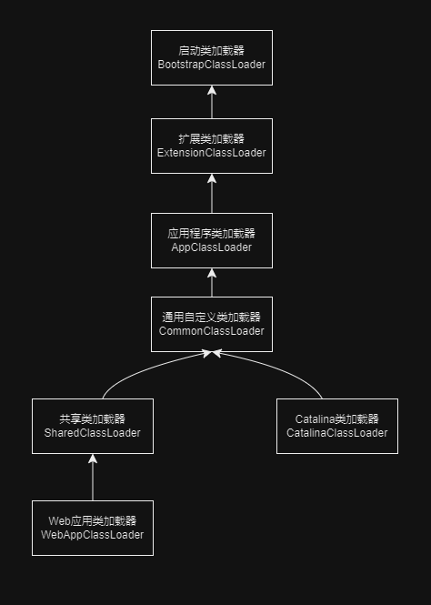

# 类加载器

- 类加载过程：加载->连接->初始化。
- 连接过程又可分为三部：验证->准备->解析

加载是类加载过程的第一步，主要完成下面 $3$ 件事情：
1. 通过全类名获取定义此类的二进制字节流。
2. 将字节流所代表的静态存储结构转换为方法区的运行时数据结构。
3. 在内存中生成一个代表该类的 `Class` 对象，作为方法区这些数据的访问入口。

## 介绍

类加载器从JDK1.0就出现了，最初只是为了满足Java Applet（已经被淘汰）的需要，后来，慢慢成为Java程序中的一个重要组成部分，赋予了Java类可以被动态加载到JVM中并执行的能力。

类加载器是一个负责加载类的对象。`ClassLoader` 是一个抽象类，给定类的二进制名称，类加载器应尝试定位或生成构成类定义的数据。典型的策略是将名称转换为文件名，然后从文件系统中读取该名称的“类文件”。

每个Java类都有一个引用指向加载它的 `ClassLoader`。不过，数组类不是通过 `ClassLoader` 创建的，而是JVM在需要的时候自动创建的，数组类通过 `getClassLoader()` 方法获取 `ClassLoader` 的时候和该数组的元素类型 `ClassLoader` 是一致的。

- 类加载器是一个负责加载类的对象，用于实现类加载过程中的加载这一步；
- 每个Java类都有一个引用指向加载它的 `ClassLoader`；
- 数组类不是通过 `ClassLoader` 创建的（数组类没有对应的二进制字节流），是由JVM直接生成的。

```java
class Class<T> {
    private final ClassLoader classLoader;

    @CallerSensitive
    public ClassLoader getClassLoader() {
        //....
    }
}
```

简单来说，类加载器的主要作用就是加载Java 类的字节码（`.class` 文件）到JVM中（在内存中生成一个代表该类的`Class` 对象）。字节码可以是Java源程序（`.java`文件）经过 `javac` 编译得来，也可以是通过工具动态生成或者通过网络下载的来。

其实除了加载类之外，类加载器还可以加载Java应用所需的资源如文本、图像、配置文件、视频等等文件资源。

## 加载原则

JVM启动的时候，并不会一次性加载所有的类，而是根据需要去动态加载，也就是说，大部分类在具体用到的时候才会去加载。

对于已经加载的类会被放在 `ClassLoader` 中。在类加载的时候，系统会首先判断当前类是否被加载过，已经被加载的类会直接返回，否则才会尝试加载。也就是说，对于一个类加载器来说，相同二进制名称的类只会被加载一次。

```java
public abstract class ClassLoader{

    private final ClassLoader parent;

    private final Vector<Class<?>> classes = new Vector<>();

    // 由VM调用，用此类加载器记录每个已经加载的类
    void addClass(CLass<?> c) {
        classes.addElement(c);
    }
}
```

## 总结

JVM中内置了三个重要的 `ClassLoader`：
1. `BootstrapCLassLoader` （启动类加载器）：最顶层的加载类，由C++实现，通常表示为null，并且没有父级，主要用来加载JDK内部的核心类库（`%JAVA_HOME%/lib` 目录下的 `rt.jar`、`resources.jar`、`charsets.jar` 等jar包和类）以及被 `-Xbootclasspath` 参数指定的路径下的所有类。
2. `ExtensionClassLoader`（扩展类加载器）：主要负责加载`%JRE_HOME%/lib/ext`目录下的jar包和类以及被`java.ext.dirs` 系统变量所指定的路径下的所有类。
3. `AppClassLoader`（应用程序类加载器）：面向用户的加载器，负责加载当前应用classpaht下的所有jar包和类。

- `rt.jar`：rt代表RunTime，`rt.jar`是Java基础类库，包含Java doc里面看到的所有的类的类文件，也就是说，我们常用内置库`java.xxx.*` 都在里面，比如`java.util.*`、`java.io.*`、`java.nio.*`、`java.lang.*`、`java.sql.*`、`java.math.*`。
- Java9引入了模块系统，并且略微更改了上述的类加载器。扩展类加载器被改名为平台类加载器（platform class loader）。JavaSE中除了少数几个关键模块，比如说 `java.base` 是由启动类加载器加载之外，其他的模块均由平台类加载器所加载。


除了这三种类加载器之外，用户还可以加入自定义的类加载器来进行扩展，以满足自己的特殊需求，就比如说，我们可以对Java类的字节码（`.class`文件）进行加密，加载时再利用自定义的类加载器对其解密。

自定义类加载器可以有同一个父加载器，自定义类加载器的父加载器同样可以是自定义加载器。

除了 `BootstrapClassLoader` 是JVM自身的一部分之外，其他所有的类加载器都是在JVM外部实现的，并且全部继承自`ClassLoader`抽象类，这样做的好处是用户可以自定义类加载器，以便让应用程序自己决定如何去获取所需的类。

每个 `ClassLoader` 可以通过 `getParent()` 获取其父 `ClassLoader`，如果获取到的 `ClassLoader` 为 `null` 的话，那么该类是通过 `BootstrapClassLoader` 加载的。

```java
public abstract class ClassLoader {
    private final ClassLoader parent;

    @CallerSensitive
    public final ClassLoader getParent() {
        //...
    }
}
```

为什么获取到 `ClassLoader` 为 `null` 就是 `BootstrapClassLoader` 加载的呢？ 这是因为 `BootstrapClassLoader` 由C++实现，由于该C++实现的类加载器在Java中没有与之对应的类，所以拿到的结果是null，下面我们来看一个获取`ClassLoader`的例子：

```java
public class PrintClassLoaderTree {
    public static void main() {
        ClassLoader classLoader = PrintClassLoaderTree.class.getClassLoader();

        StringBuilder split = new StringBuilder("|--");
        boolean needContinue = true;
        while (needContinue) {
            System.out.println(split.toString() + classLoader);
            if (classLoader == null) {
                needContinue = false;
            } else {
                classLoader = classLoader.getParent();
                split.insert(0, "\t");
            }
        }
    }
}
```

输出结果为：
```java
|--jdk.internal.loader.ClassLoaders$AppClassLoader@5e481248
	|--jdk.internal.loader.ClassLoaders$PlatformClassLoader@41906a77
		|--null
```

从输出结果可以看出：
- 我们编写的Java类 `PrintClassLoaderTree` 的 `ClassLoader` 是 `AppClassLoader`；
- `AppClassLoader` 的 父 `ClassLoader` 是 `ExtClassLoader`；
- `ExtClassLoader` 的 父`ClassLoader` 是 `Bootstrap ClassLoader`，因此输出结果为null。

## 自定义类加载器

除了 `BootstrapClassLoader` 其他类加载器均由 Java 实现且全部继承自 `java.lang.ClassLoader`。如果我们要自定义自己的类加载器，很明显需要继承 `ClassLoader` 抽象类。

`ClassLoader` 类有两个关键 的方法：
- `protected Class loadClass(String name, boolean resolve)`：加载指定二进制名称的类，实现了双亲委派机制。`name` 为类的二进制名称，`resolve`如果为`true`，在加载时调用`resolveClass(Class<?> c)` 方法解析该类。
- `protected Class findClass(String name)`：根据类的二进制名称来查找类，默认实现是空方法。

建议 `ClassLoader` 子类重写 `findClass(String name)` 方法而不是 `loadClass(String name, boolean resolve)` 方法。

如果我们不想打破双亲委派模型，就重写 `ClassLoader` 中的 `findClass`方法即可，无法被父类加载器加载的类最终会通过这个方法被加载。但是，如果想打破双亲委派模型则需要重写`loadClass()`方法。

## 双亲委派模型

类加载器有很多种，当我们想要加载一个类的时候，具体是哪个类加载器加载呢？这就需要提到双亲委派模型了。

`ClassLoader` 类使用委托模型来搜索类和资源，每个 `ClassLoader` 实例都有一个相关的父类加载器。需要查找类或资源时，`ClassLoader` 实例会在试图亲自查找类或资源之前，将搜索类或资源的任务委托给其父类加载器。

虚拟机中被称为 `bootstrap class loader` 的内置类加载器本身没有父类加载器，但是可以作为 `ClassLoader` 实例的父类加载器。

- `ClassLoader`类使用委托模型来搜索类和资源。
- 双亲委派模型要求除了顶层的启动类加载器外，其余的类加载器都要有自己的父类加载器。
- `ClassLoader` 实例会在试图亲自查找类或资源之前，将搜索类或资源的任务委托给其父类加载器。

注意：双亲委派模型并不是以中国强制性的约束，只是JDK官方推荐的一种方式，如果我们因为某些特殊需求想要打破双亲委派模型，也是可以的。

其实这个双亲翻译的容易让人无界，我们一般理解的双亲都是父母，这里的双亲更多地表达的是“父母这一辈”的人而已，并不是说真的有一个 `MotherClassLoader` 和一个 `FatherClassLoader`。 

另外，类加载器之间的父子关系一般不是以继承的关系来实现的，而是通常使用组合关系来复用父加载器的代码。

```java
public abstract class ClassLoader {
    //组合
    private final ClassLoader parent;
    protected ClassLoader(ClassLoader parent) {
        this(checkCreateClassLoader(), parent);
    }
}
```

在面向对象编程中，有一条非常经典的设计原则：组合优于继承，多用组合少用继承。

## 双亲委派模型执行流程

双亲委派模型的实现代码非常简单，逻辑非常清晰，都集中在`java.lang.ClassLoader` 的 `loadClass()` 中，相关代码如下：
```java
protected Class<?> loadClass(String name, boolean resolve) throws ClassNotFoundException {
    synchronized (getClassLoadingLock(name)) {
        // 首先 检查该类是否已经加载过
        Class c = findLoadedClass(name);
        if (c == null) {
            // 如果 c 为 null 说明没有被加载过
            long t0 = System.nanoTime()l
            try {
                if (parent != null) {
                    // 当父类的加载器不为空，则通过父类的LoadClass来加载该类
                    c = parent.loadClass(name, false);
                } else {
                    // 当父类的加载器为空，则调用启动类加载器来加载
                    c = findBootstrapClassOrNull(name);
                }
            } catch (ClassNotFoundException e) {
                // 非空父类的类加载器无法找到相应的类，抛出异常
            }

            if (c == null) {
                // 当父类加载器无法加载时，则调用 findClass 方法加载
                long t1 = System.nanoTime();
                c = findClass(name);
                // 用于统计类加载器相关信息

                PerfCounter.getParentDelegationTime().addTime(t1 - t0);
                PerfCounter.getFindClassTime().addElapsedTimeFrom(t1);
                PerfCounter.getFindClasses().increment();
            }
        }

        if (resolve) {
            // 对类进行 link 操作
            resolveClass(c);
        }
        return c;
    }
}
```

每当一个类加载器接收到加载请求时，它会先将请求转发给父类加载器，在父类加载器没有找到所请求的类的情况下，该类加载器才会尝试去加载。

结合上面的源码，简单总结一下双亲委派模型的执行流程：
- 在类加载的时候，系统会首先判断当前类是否被加载过，已经被加载打的类会直接返回，否则才会尝试加载（每个父类加载器都会走一遍这个流程）。
- 类加载器在进行类加载的时候，它首先不会自己去尝试加载这个类，而是把这个请求委派给父类加载器去完成（调用父加载器 `loadClass()` 方法来加载类）。这样的话，所有的请求最终都会传送到顶层的启动类加载器 `BootstrapClassLoader` 中。
- 只有当父加载器反馈自己无法完成这个加载请求（它的搜索范围中没有找到所需的类）时，子加载器才会尝试自己去加载（调用自己的 `findClass()`方法来加载类）。
- 如果子类加载器也无法加载这个类，那么它会抛出一个 `ClassNotFoundException` 异常。

JVM判断两个Java类是否相同的具体规则：JVM不仅要看类的全名是否相同，还要看加载此类的类加载器是否一样，只有两者都相同的情况下，才认为两个类是相同的，即使两个类来源于同一个`class` 文件，被同一个虚拟机加载，只要加载它们的类加载器不同，那这两个类就必定不相同。

## 双亲委派模型优点

双亲委派模型保证了 Java 程序的稳定运行，可以避免类的重复加载（JVM 区分不同类的方式不仅仅根据类名，相同的类文件被不同的类加载器加载产生的是两个不同的类），也保证了Java的核心API不被篡改。

如果没有使用双亲委派模型，而是每个类加载器加载自己的话就会出现一些问题，比如我们编写一个称为 `java.lang.Object` 类的话，那么程序运行时，系统就会出现两个不同的 `Object` 类。双亲委派模型可以保证加载的是JRE里的那个 `Object` 类，而不是你写的 `Object` 类，这是因为 `AppClassLoader` 在加载你的`Object` 类时，会委托给 `ExtClassLoader` 去加载，而 `ExtClassLoader` 又会委托给 `BootstrapClassLoader`，`BootstrapClassLoader` 发现自己已经加载过 `Object` 类，会直接返回，而不会去加载你的 `Object` 类。

## 打破双亲委派模型

自定义类加载器，需要继承 `ClassLoader`，如果我们不想打破双亲委派模型，就重写 `ClassLoader` 类中的 `findClass()` 方法即可，无法被父类加载器加载的类最终会通过这个方法被加载，但是，如果想打破双亲委派模型则需要重写 `loadClass()` 方法。

为什么重写`loadClass()` 方法就打破双亲委派模型呢？双亲委派模型的执行流程已经解释了：类加载器在进行类加载的时候，它首先不会自己去尝试加载这个类，而是把这个请求委派给父类加载器去完成（调用父加载器 loadClass()方法来加载类）。

重写 `loadClass()` 方法之后，我们就可以改变传统双亲委派模型的执行流程，例如，子类加载器可以在委派给父类加载器之前，先自己尝试加载这个类，或者在父类加载器返回之后，再尝试从其他地方加载这个类，具体的规则由我们自己实现，根据项目需求定制化。

我们比较熟悉的Tomcat服务器为了能够优先加载Web应用目录下的类，然后再加载其他目录下的类，就自定义了类加载器`WebAppClassLoader` 来打破双亲委派机制，这也是Tomcat下Web应用之间的类实现隔离的具体原理。



Tomcat这四个自定义的类加载器对应的目录如下：
- `CommonClassLoader` 对应 `<Tomcat>/common/*`
- `CatalinaClassLoader` 对应 `<Tomcat>/server/*`
- `SharedClassLoader` 对应 `<Tomcat>/shared/*`
- `WebAppClassLoader` 对应 `<Tomcat>/webapps/<app>/WEB-INF/*`

从图中的委派关系可以看出：
- `CommonClassLoader`作为 `CatalinaClassLoader` 和 `SharedClassLoader` 的父加载器。`CommonClassLoader` 能加载的类都可以被 `CatalinaClassLoader` 和 `SharedClassLoader` 使用。因此，`CommonClassLoader` 是为了实现公共类库（可以被所有 Web 应用和 Tomcat 内部组件使用的类库）的共享和隔离。
- `CatalinaClassLoader` 和 `SharedClassLoader` 能加载的类则与对方相互隔离。`CatalinaClassLoader` 用于加载 Tomcat 自身的类，为了隔离 Tomcat 本身的类和 Web 应用的类。`SharedClassLoader` 作为 `WebAppClassLoader` 的父加载器，专门来加载 Web 应用之间共享的类比如 Spring、Mybatis。
- 每个 Web 应用都会创建一个单独的 `WebAppClassLoader`，并在启动 Web 应用的线程里设置线程线程上下文类加载器为 `WebAppClassLoader`。各个 `WebAppClassLoader` 实例之间相互隔离，进而实现 Web 应用之间的类隔。

单纯依靠自定义类加载器没办法满足某些场景的要求，例如，有些情况下，高层的类加载器需要加载低层的加载器才能加载的类。


