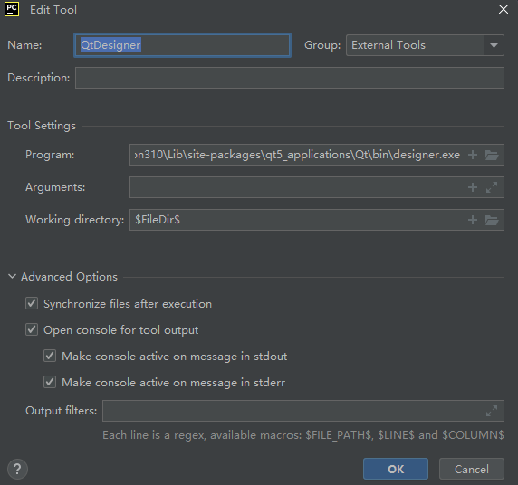
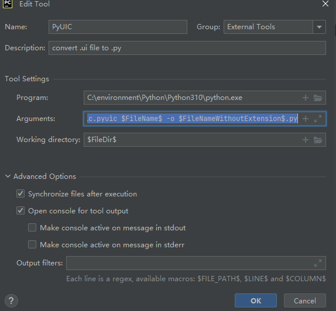

# Qt Designer

`pip install pyqt5`
`pip install pyqt5-tools`

在 `pyqt5-tools/designer` 文件夹下找到 `designer.exe` 文件， 配置到 PyCharm 的 External Tools 即可， 如下：

# PyUIC

如下：

Arguments:`-m PyQt5.uic.pyuic $FileName$ -o $FileNameWithoutExtension$.py`