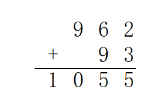
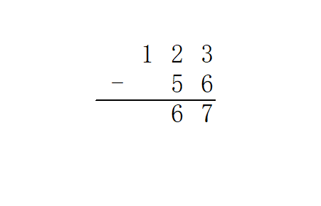
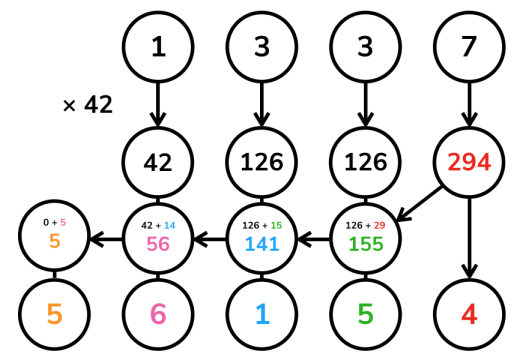

# 高精度计算

高精度计算（Arbitrary-Precision Arithmetic），也被称作大整数（bitnum）计算，运用了一些算法结构来支持更大整数间的运算（数字大小超过语言内建整型）。

## 引入

高精度问题包含很多小的细节，实现上也有很多讲究。

所以今天就来一起实现一个简单的计算器吧。

> 输入：一个形如`a<op>b`的表达式。
> - `a`、`b`分别是长度不超过`1000`的十进制非负整数；
> - `<op>`是一个字符(`+`、`-`、`*`或`/`)，表示运算。
> - 整数与运算符之间由一个空格分隔。
>
> 输出：运算结果
> - 对于`+`、`-`、`*`运算，输出一行表示结果；
> - 对于`/`运算，输出两行分别表示商和余数。
> - 保证结果均为非负整数。

## 存储

在平常的实现中，高精度数字利用字符串表示就，每一个字符表示数字的一个十进制位。因此可以说，高精度数值计算实际上是一种特别的字符串处理。

读入字符串时，数字最高位在字符串首（下标小的位置）。但是习惯上，下标最小的位置存放的是数字的**最低位**，即存储反转的字符串。这么做的原因在于，数字的长度可能发生变化，但我们希望同样权值位始终保持对其（例如，希望所有的个位都在下标`[0]`，所有的十位都在下标`[1]`...）；同时，加、减、乘的运算一般都从个位开始进行，这都给了$\lceil$反转存储$\rfloor$以充分的理由。

此后我们将一直沿用这一约定。定义一个常数`LEN=1004`表示程序所容纳的最大长度。

由此不难写出读入高精度数字的代码：

```cpp
void clear(int a[]) {
    for (int i = 0; i < LEN; i++) {
        a[i] = 0;
    }
}

void read(int a[]) {
    static char s[LEN + 1];
    scanf("%s", s);

    clear(a);

    int len = strlen(s);
    for (int i = 0; i < len; i++) {
        a[len - i - 1] = s[i] - '0';
    }
}
```

输出也按照存储的逆序输出，由于不希望输出前导零，故这里从最高位开始向下寻找第一个非零位，从此开始输出；终止条件$i\geq 1$而不是$i\geq 0$是因为当整个数字为`0`时仍然希望输出一个字符`0`。

```cpp
void print(int a[]) {
    int i;
    for (i = LEN - 1; i >= 1; i--) {
        if (a[i] != 0) break;
    }
    for (; i >= 0; i--) {
        putchar(a[i] + '0');
    }
    putchar('\n');
}
```

## 四则运算

四则运算中难度也各不相同。最简单的是高精度加减法，其次是高精度-单精度（普通的`int`）乘法和高精度-高精度乘法，最后是高精度-高精度除法。

我们将按这个顺序分别实现所有要求的功能。

### 加法

高精度加法，其实就是竖式加法。



也就是从最低位开始，将两个加数对应位置上的数码相加，并判断是否达到或超过`10`。如果达到，那么处理进位：将更高一位的结果上增加`1`，当前位的结果减少`10`。

```cpp
void add(int a[], int b[], int c[]) {
    clear(c);

    for (int i = 0; i < LEN - 1; i++) {
        c[i] += a[i] + b[i];
        if (c[i] >= 10) {
            c[i + 1] += 1;
            c[i] -= 10;
        }
    }
}
```

### 减法

高精度减法，也就是竖式减法。



从个位起逐位相减，遇到负的情况则向上一位借`1`。
```cpp
void sub(int a[], int b[], int c[]) {
    clear(c);
    for (int i = 0; i < LEN - 1; i++) {
        c[i] += a[i] - b[i];
        if (c[i] < 0) {
            c[i + 1] -= 1;
            c[i] += 10; 
        }
    }
}
```

试一试，上述减法代码，输入`1 2`——输出`/9999999`。

事实上，上面的代码只能处理被减数`a`大于等于减数`b`的情况。处理被减数比减数小，即$a<b$的情况很简单。

$a-b=-(b-a)$

要计算`b-a`的值，因为有$b>a$，可以调用以上代码中的`sub`函数，最后加上负号即可。

### 乘法

#### 高精度-单精度

先考虑一个简单的情况：乘数中的一个是普通的`int`类型。有没有简单的处理方法呢？

一个直观的思路是直接将$a$每一位上的数字乘以$b$。从数值上来说，这个方法是正确的，但它并不符合十进制表示法，因此需要将它重新整理成正常的样子。

重整的方式，也是从个位开始诸位向上处理进位。但是这里的进位可能非常大，甚至远大于$9$，因为每一位被乘上之后都可能达到$9\times b$的数量级。所以这里的进位不能再简单地进行`-10`运算，而是要通过除以`10`的商以及余数计算。



当然，也是出于这个原因，这个方法需要特别关注乘数$b$的范围。若它和$10^{9}$（或相应整型的取值上界）属于同一数量级，那么需要慎用高精度-单精度乘法。

```cpp
void mul_short(int a[], int b, int c[]) {
    clear(c);

    for (int i = 0; i < LEN - 1; i++) {
        c[i] += a[i] * b;

        if (c[i] >= 10) {
            c[i + 1] += c[i] / 10;
            c[i] %= 10;
        }

    }
}
```

#### 高精度-高精度

如果两个乘数都是高精度，那么竖式乘法就可以解决了。

回想竖式乘法的每一步，实际上是计算了若干$a\times b_i\times 10^{i}$的和。例如计算$1337\times 42$，计算的就是$1337\times 2\times 10^{0}+1337\times 4\times 10^{1}$

于是可以将$b$分解为它的所有数码，其中每个数码都是单精度数，将他们分别与$a$相乘，再向左移动到各自的位置上相加即得答案。当然，最后也需要与上面相同的方式处理进位。


注意这个过程与竖式乘法不尽相同，我们的算法在每一步乘的过程中并不进位，而是将所有的结果保留在对应的位置上，到最后再统一处理进位，但这不会影响结果。


