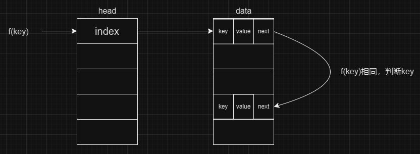

# 哈希表

## 引入


哈希表又称散列表，一种以「key-value」形式存储数据的数据结构。所谓以「key-value」形式存储数据，是指任意的键值 key 都唯一对应到内存中的某个位置。只需要输入查找的键值，就可以快速地找到其对应的 value。可以把哈希表理解为一种高级的数组，这种数组的下标可以是很大的整数，浮点数，字符串甚至结构体。

## 哈希函数

要让键值对应到内存中的位置，就要为键值计算索引，也就是计算这个数据应该放到哪里。这个根据键值计算索引的函数就叫做哈希函数，也称散列函数。举个例子，如果键值是一个人的身份证号码，哈希函数就可以是号码的后四位，当然也可以是号码的前四位。生活中常用的「手机尾号」也是一种哈希函数。在实际的应用中，键值可能是更复杂的东西，比如浮点数、字符串、结构体等，这时候就要根据具体情况设计合适的哈希函数。哈希函数应当易于计算，并且尽量使计算出来的索引均匀分布。

能为 `key` 计算索引之后，我们就可以知道每个键值对应的值 `value` 应该放在哪里了。假设我们用数组 `a` 存放数据，哈希函数是 `f`，那键值对 `(key, value)` 就应该放在 `a[f(key)]` 上。不论键值是什么类型，范围有多大，`f(key)` 都是在可接受范围内的整数，可以作为数组的下标。

在 `OI` 中，最常见的情况应该是键值为整数的情况。当键值的范围比较小的时候，可以直接把键值作为数组的下标，但当键值的范围比较大，比如以 `10^9` 范围内的整数作为键值的时候，就需要用到哈希表。一般把键值模一个较大的质数作为索引，也就是取 $f(x)=x \bmod M $作为哈希函数。

另一种比较常见的情况是 `key` 为字符串的情况，由于不支持以字符串作为数组下标，并且将字符串转化成数字存储也可以避免多次进行字符串比较。所以在 `OI` 中，一般不直接把字符串作为键值，而是先算出字符串的哈希值，再把其哈希值作为键值插入到哈希表里。关于字符串的哈希值，我们一般采用进制的思想，将字符串想象成一个 127 进制的数。那么，对于每一个长度为 `n `的字符串 `s`，就有：

$$x = s_0 \cdot 127^0 + s_1 \cdot 127^1 + s_2 \cdot 127^2 + \dots + s_n \cdot 127^n$$

我们可以将得到的 `x` 对 $2^{64}$（即 unsigned long long 的最大值）取模。这样 `unsigned long long `的自然溢出就等价于取模操作了。可以使操作更加方便。

这种方法虽然简单，但并不是完美的。可以构造数据使这种方法发生冲突（即两个字符串的 x 对 $2^{64}$ 取模后的结果相同）。
我们可以使用双哈希的方法：选取两个大质数 `a,b`。当且仅当两个字符串的哈希值对 `a` 和对 `b` 取模都相等时，我们才认为这两个字符串相等。这样可以大大降低哈希冲突的概率。

## 冲突

如果对于任意的键值，哈希函数计算出来的索引都不相同，那只用根据索引把` (key, value)` 放到对应的位置就行了。但实际上，常常会出现两个不同的键值，他们用哈希函数计算出来的索引是相同的。这时候就需要一些方法来处理冲突。在` OI` 中，最常用的方法是拉链法。

### 拉链法(链地址法)

拉链法也称开散列法（open hashing）



```c++
#include <iostream>
using namespace std;
const int SIZE = 1000000;
const int M = 999997;
class HashTable {
private:
    struct Node {
        int next, value, key;
    } data[SIZE];

    int head[M], size;

    int f(int key) {return (key % M + M) % M;}
public:
    int get(int key) {
        for (int p = head[f(key)];p; p = data[p].next) {
            if (key == data[p].key) return data[p].value;
        }
        return -1;
    }

    int modify(int key, int value) {
        for (int p = head[f(key)];p; p = data[p].next) {
            if (data[p].key == key) return data[p].value = value;
        }
        return -1;
    }

    int add(int key, int value) {
        if (get(key) != -1) return -1;
        data[++size] = (Node){head[f(key)], value, key};
        head[f(key)] = size;
        return value;
    }
};
```

### 闭散列法

闭散列方法把所有记录直接存储在散列表中，如果发生冲突则根据某种方式继续进行探查。

闭散列，也叫开放定址法，当发生哈希冲突时，如果哈希表未被装满，说明在哈希表种必然还有空位置，那么可以把产生冲突的元素存放到冲突位置的“下一个”空位置中去

比如线性探查法：如果在 $d$ 处发生冲突，就依次检查 $d + 1，d + 2……$

- 线性探测：当发生哈希冲突时，从发生冲突的位置开始，依次向后探测，直到找到下一个空位置为止。`Hi = (H0 + i) % M {i = 1, 2, 3, ....}`

- 平方探测：线性探测的缺陷是产生冲突的数据堆积在一起，平方探测可以有效解决这一问题。`Hi = (H0 + i * i) % M {i = 1, 2, 3, ....}`

```c++
#include <iostream>
#include <vector>
using namespace std;
enum State
{
	EMPTY,
	EXIST,
	DELETE
};

//哈希表每个位置的存储结构
template<class K, class V>
struct HashData
{
	pair<K, V> m_kv;
	State m_state = EMPTY;
};

//哈希表
template<class K, class V>
class HashTable
{
public:
	//哈希表的查找
	HashData<K, V>* Find(const K& key)
	{
		if (0 == this->m_Table.size())
		{
			return nullptr;
		}
		size_t start = key % this->m_Table.size();
		size_t index = start;
		size_t i = 1;
		while (this->m_Table[index].m_state != EMPTY)
		{
			if (this->m_Table[index].m_state == EXIST && this->m_Table[index].m_kv.first == key)
			{
				return &this->m_Table[index];
			}
			index = start + i;			//线性探索
			//index = start + (i * i)   //平方探索
			index %= this->m_Table.size();
			i++;
		}
		return nullptr;
	}

	//哈希表的插入
	bool Insert(const pair<K, V>& kv)
	{
		//1.插入哈希表中是否已经存在该键值的键值对，若存在则插入失败
		HashData<K, V>* ret = Find(kv.first);
		if (ret)
		{
			return false;
		}
		//2.判断是否需要调整哈希表的大小
		if (0 == this->m_Table.size())
		{
			this->m_Table.resize(10);
		}
		else if ((double)this->m_Num / (double)this->m_Table.size() > 0.7)
		{
			//创建一个新的hash表，设置该大小为原来hash表的两倍
			HashTable<K,V> newHT;
			newHT.m_Table.resize(2 * this->m_Table.size());
			//将原hash表中的数据插入到新hash中
			for (auto& e : this->m_Table)
			{
				if (e.m_state == EXIST)
				{
					newHT.Insert(e.m_kv);
				}
			}
			//将原hash表和新hash表交换即可
			this->m_Table.swap(newHT.m_Table);
		}
		//3.将键值对插入哈希表中
		size_t start = kv.first % this->m_Table.size();
		size_t index = start;
		size_t i = 1;
		while (this->m_Table[index].m_state == EXIST)
		{
			index = start + i;						//线性探测
			//index = start + (i * i);				//平方探测
			index %= this->m_Table.size();
			i++;
		}
		this->m_Table[index].m_kv = kv;
		this->m_Table[index].m_state = EXIST;
		//4.hash表中有效元素个数加1
		this->m_Num++;
		return true;
	}

	//哈希表的删除
	bool Erase(const K& key)
	{
		HashData<K, V>* ret = Find(key);
		if (!ret)
		{
			return false;
		}
		ret->m_state = DELETE;
		this->m_Num--;
		return true;
	}
private:
	vector<HashData<K, V>> m_Table;
	size_t m_Num = 0;//哈希表的有效元素个数，方便后续计算负载因子来判断是否需要扩容
};

int main()
{
	HashTable<int, int> HT;
	HT.Insert(make_pair(1, 1));
	HT.Insert(make_pair(2, 2));
	HT.Insert(make_pair(3, 3));
	HT.Insert(make_pair(4, 4));
	HashData<int, int>* ret1 = HT.Find(3);
	if (ret1)
	{
		cout << "ret1 = " << ret1->m_kv.second << endl;
	}
	else
	{
		cout << "未找到！" << endl;
	}
	HT.Erase(3);
	HashData<int, int>* ret2 = HT.Find(3);
	if (ret2)
	{
		cout << "ret2 = " << ret2->m_kv.second << endl;
	}
	else
	{
		cout << "未找到！" << endl;
	}
	system("pause");
	return 0;
}
```