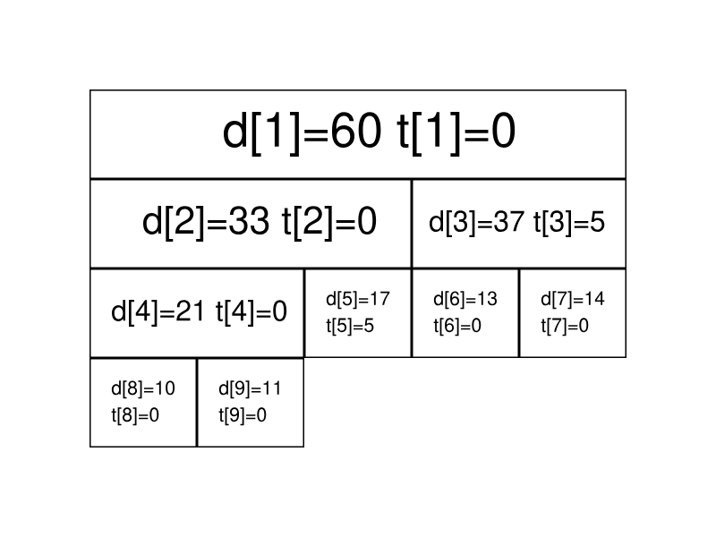

# 线段树

## 引入

线段树是常用来维护**区间信息**的数据结构。

线段树可以在$O(logN)$的时间复杂度内实现单点修改、区间修改、区间查询（区间求和，求区间最大值，求区间最小值）等操作。

## 线段树

### 线段树的基本结构与建树

#### 过程

线段树将每个长度不为$1$的区间划分成左右两个区间递归求解，把整个线段划分为一个树形结构，通过合并左右两个区间信息来求得该区间得信息。这种数据结构可以方便的进行大部分的区间操作。

有个大小为$5$的数组$a=\{10,11,12,13,14\}$，要将其转化为线段树，有以下做法：设线段树的根节点编号为$1$，用数组$d$来保存线段树，$d_{i}$用来保存线段树上编号为$i$的节点的值（这里每个节点所维护的值就是这个节点所表示的区间总和）。

我们先给出这棵线段树的形态，如下图所示：


图中每个节点中用红色字体标明的区间，表示该节点管辖的$a$数组上的区间，如$d_{1}$所管辖的区间就是$[1,5]$，即$d_1$所保存的值是$a_1+a_2+a_3+a_4+a_5$，$d_1=60$，表示其和为$60$。

通过观察不难发现，$d_i$的左儿子节点就是$d_{2i}$，$d_i$的右二子节点就是$d_{2i+1}$。如果$d_i$表示的是区间$[s,t]$（即$d_i=a_s+a_{s+1}+...+a_{t}$）的话，那么$d_i$的左儿子节点表示的是区间$[s,\frac{s+t}{2}]$，$d_i$的右二子表示的是区间$[\frac{s+t}{2} + 1, t]$。

在实现时，我们考虑递归建树。设当前根节点为$p$，如果根节点管辖的区间长度已经是$1$，则可以直接根据$a$数组上相应位置的值初始化该节点。否则我们将该区间从中点处分割为两个子区间，分别进入左右子节点递归建树，最后合并两个子节点的信息。

#### 实现

```c++
void build(int s, int t, int p) {
    //当前根的编号是 p 对应管辖区间为[s,t]
    if (s == t) {
        d[p] = a[s];
        return;
    }
    int mid = (s + t) / 2;
    build(s, mid, p << 1);
    build(mid + 1, t, (p << 1) + 1);
    d[p] = d[p << 1] + d[(p << 1) + 1];
}
```

关于线段树的空间，如果采用堆式存储（$2p$是$p$的左儿子，$2p+1$是$p$的右二子），若有$n$个叶子结点，则$d$数组的范围最大为$2^{\lceil logn\rceil +1}$。

分析：容易知道线段树的深度是$\lceil logn\rceil$的，则在堆式存储情况下叶子节点（包括无用的叶子节点）数量为$2^{\lceil logn\rceil}$个，又由于其为一棵完全二叉树，则其总节点个数为$2^{\lceil logn\rceil + 1}-1$。当然如果懒得计算可以直接把数组长度设置为$4n$，因为$\frac{2^{\lceil logn\rceil}-1}{n}$的最大值在$n=2^x+1(x\in N_{+})$时取到，此时节点数为$2^{\lceil logn\rceil + 1} -1 = 2^{x+2}-1=4n-5$

### 线段树的区间查询

#### 过程

区间查询，比如求区间$[l,r]$的总和（即$a_{l}+a_{l+1}+...+a_r$），求区间最大值/最小值等操作。


仍然以最开始的图为例，如果要查询区间$[1,5]$的和，那么直接取$d_1$的值($60$)即可。

如果要查询的区间为$[3,5]$，此时就不能直接获取区间的值，但是$[3,5]$可以拆分成$[3,3]$和$[4,5]$，可以通过合并这两个区间的答案来求得这个区间的答案。

一般地，如果要查询的区间是$[l,r]$，则可以将其拆分成最多为$O(logn)$个**极大**的区间，合并这些区间即可求出$[l,r]$的答案。

#### 实现

```c++
int getsum(int l, int r, int s, int t, int p) {
    // 节点编号 p 对应管辖的区间[s,t] 要查找[l,r]的和
    if (l <= s && t <= r) {
        return d[p];
    }
    int mid = (s + t) / 2;
    int sum = 0;
    if (l <= mid) sum = getsum(l, r, s, mid, p << 1);
    if (mid < r) sum += getsum(l, r, mid + 1, t, (p << 1) + 1);
    return sum;
}
```

### 线段树的区间修改与懒标记

#### 过程

如果要求修改区间$[l,r]$，把所有包含在区间$[l,r]$中的节点都遍历一遍，修改一遍，时间复杂度无法承受，我们这里引入一个$\lceil 懒惰标记 \rfloor$的东西。

懒惰标记，简单来说，就是通过延迟对节点信息的更改，从而减少可能不必要的操作次数。每次执行修改时，我们通过打标记得方法表明该节点对应得区间在某一次操作中被更改，但不更新该节点得子节点信息，实质性的修改则在下一次访问带有标记的节点时才进行。

仍然以最开始的图为例，我们将执行若干次给区间内的数加上一个值的操作，我们现在给每个节点增加一个$t_i$，表示该节点带的标记值。

最开始时的情况如下：


现在我们准备给$[3,5]$上的每个数都加上$5$。根据前面区间查询的经验，我们很快找到了两个极大区间$[3,3]$和$[4,5]$（分别对应线段树上的$3$号点和$5$号点）。

我们直接在这两个节点上进行修改，并给它们打上标记；



我们发现，$3$号节点的信息虽然被修改了（因为该区间管辖两个数，所以$d_3$加上的数是$5×2=10$），但它的两个子节点却还没有更新，仍然保留着修改之前的信息。不过不用担心，虽然修改目前还没进行，但当我们要查询这两个子节点的信息时，我们会利用标记修改这两个子节点的信息，使查询的结果依旧准确。

接下来我们查询一下$[4,4]$区间上的和。

我们通过递归找到$[4,5]$区间，发现该区间并非我们的目标区间，且该区间上存在标记，这时候就到了标记下放的时间了，我们将该区间的两个子区间的信息更新，并清除该区间上的标记。


现在$6,7$两个节点的值变为了最新的值，查询的结果也是准确的。

#### 实现

接下来给出存在标记的情况下，区间修改和查询操作的参考：

```c++
void update(int l, int r, int c, int s, int t, int p) {
    //编号 p 管辖区间[s,t] 需要修改[l,r]区间的值 变化量为c
    if (l <= s && t <= r) {
        d[p] += (t - s + 1) * c;
        lazy[p] += c; //懒标记
        return;
    }
    int mid = (s + t) / 2;
    if (lazy[p] && s != t) {
        // 只有当前懒标记不为空 且 有子节点 才修改子节点 和下放 lazy
        d[p << 1] += (mid - s + 1) * lazy[p]; 
        d[(p << 1) + 1] += (t - mid) * lazy[p];
        lazy[p << 1] += lazy[p];
        lazy[(p << 1) + 1] += lazy[p];
        lazy[p] = 0;
    }
    if (l <= mid) update(l, r, c, s, mid, p << 1);
    if (mid < r) update(l, r, c, mid + 1, t, (p << 1) + 1);
    d[p] = d[p << 1] + d[(p << 1) + 1];
}

```

```c++
int getsum(int l, int r, int s, int t, int p) {
    // 编号 p 管辖区间[s,t] 需要查询区间[l,r]
    if (l <= s && t <= r) {
        return d[p];
    }
    int mid = (s + t) / 2;
    if (lazy[p] && s != t) {
        d[p << 1] += (mid - s + 1) * lazy[p]; 
        d[(p << 1) + 1] += (t - mid) * lazy[p];
        lazy[p << 1] += lazy[p];
        lazy[(p << 1) + 1] += lazy[p];
        lazy[p] = 0;
    }
    int sum = 0;
    if (l <= mid) sum = getsum(l, r, s, mid, p << 1);
    if (mid < r) sum += getsum(l, r, mid + 1, t, (p << 1) + 1);
    return sum;
}

```

### 动态开点线段树

前面讲到堆式存储的情况下，需要给线段树开$4n$大小的数组，为了节省空间，我们可以不一次性建好树，而是在最初只建立一个根节点代表整个区间。当我们需要访问某个子区间时，才建立代表这个区间的子节点。这样我们不再使用$2p$和$2p+1$代表$p$节点的儿子，而是用$ls$和$rs$记录儿子的编号，总之，动态开点线段树的核心思想就是：**结点只有在有需要的时候才被创建**。

单次操作的时间复杂度是不变的，为$O(logn)$。由于每次操作都有可能创建并访问全新的一系列节点，因此$m$次单点操作后节点的数量规模是$O(mlogn)$，最多也只需要$2n-1$个节点，没有浪费。

## 例题

[Danil and a Part-time Job](https://codeforces.com/problemset/problem/877/E)

其实问题可以看作，`pow`操作是修改某区间，让其$0$变为$1$，$1$变为$0$，`get`操作是获取某区间之和。而一棵树如何能变成类似区间操作呢？其实树的$DFS$序列，每个子树都对应$DFS$序列中的连续一段，而我们只需要记住哪个节点作为子树的区间起始点和终止点即可。

```cpp
#include <iostream>
#include <algorithm>
#include <vector>

using namespace std;
const int N = 2e5 + 10;

int tim = 0;
int in[N], ou[N], dfn[N];
int t[N];
vector<int> graph[N];

struct Tree {
    int l, r;
    int lazy;
    int sum;
} tree[N << 3];

void dfs(int rt, int fa) {
    in[rt] = ++tim;
    dfn[tim] = rt;
    for (auto to : graph[rt]) {
        if (to == fa) continue;
        dfs(to, rt);
    }
    ou[rt] = tim;
}

void push_up(int rt) {
    tree[rt].sum = tree[rt << 1].sum + tree[rt << 1 | 1].sum;
}

void push_down(int rt) {
    if (tree[rt].lazy) {
        tree[rt<<1].lazy^=1;
        tree[rt<<1].sum=(tree[rt<<1].r-tree[rt<<1].l+1)-tree[rt<<1].sum;
        tree[rt<<1|1].lazy^=1;
        tree[rt<<1|1].sum=(tree[rt<<1|1].r-tree[rt<<1|1].l+1)-tree[rt<<1|1].sum;
        tree[rt].lazy=0;
    }
}

void build(int index, int l, int r) {
    tree[index].l = l;
    tree[index].r = r;
    tree[index].lazy = 0;
    if (l == r) {
        tree[index].sum = t[dfn[l]];
        return;
    }
    int mid = ((r - l) >> 1) + l;
    build((index << 1), l, mid);
    build((index << 1) | 1, mid + 1, r);
    push_up(index);
}

void update(int index, int l, int r) {
    if (tree[index].l > r || tree[index].r < l) return;
    if (tree[index].l >= l && tree[index].r <= r) {
        tree[index].sum = (tree[index].r - tree[index].l + 1) - tree[index].sum;
        tree[index].lazy ^= 1;
        return;
    }
    push_down(index);
    int mid = ((tree[index].r - tree[index].l) >> 1) + tree[index].l;
    if (l <= mid) update((index << 1), l, r);
    if (mid < r) update((index << 1) | 1, l, r);
    push_up(index);
}

int query(int index, int l, int r) {
    if (tree[index].l > r || tree[index].r < l) return 0;
    if (tree[index].l >= l && tree[index].r <= r) return tree[index].sum;
    push_down(index);
    int ans = 0;
    int mid = ((tree[index].r - tree[index].l) >> 1) + tree[index].l;
    if (l <= mid) ans += query((index << 1), l, r);
    if (mid < r) ans += query((index << 1) | 1, l, r);
    push_up(index);
    return ans;
}

int main() {
    int n, q;
    cin >> n;
    
    for (int i = 2; i <= n; i++) {
        int x;
        cin >> x;
        graph[x].push_back(i);
        graph[i].push_back(x);
    }

    for (int i = 1; i <= n; i++) {
        cin >> t[i];
    }
    // 计算dfs序
    dfs(1, -1);
    build(1, 1, n);
    cin >> q;
    while (q--) {
        char check[4];
        int v;
        scanf("%s%d",check,&v);
        if(check[0]=='p') update(1,in[v],ou[v]);
        else printf("%d\n",query(1,in[v],ou[v]));
    }
    return 0;
}
```

[Bash and Tough Math Puzzle](https://codeforces.com/contest/914/problem/D)

正常的线段树操作，单点修改，区间访问，因为$gcd$操作符合结合律，有$gcd(a_1,a_2,a_3)=gcd(gcd(a_1,a_2),a_3)$因此，可以求得区间$gcd$，而想知道是否可以修改一个元素来达到区间$gcd=x$，可以分情况讨论，如果当前区间就等于$x$则直接满足要求，如果不是则可以继续将区间分成两个区间，看是否有一个区间是$x$的倍数，那么原问题就转换为新区间的$gcd=x$了。

```cpp
#include<stdio.h>
#include<iostream>
#include<algorithm>
using namespace std;
const int maxn = 5e5+5;
int a[maxn];
struct T
{
    int l,r,mid;
    int GCD;
}tree[maxn<<2];
void push_up(int rt)
{
    tree[rt].GCD=__gcd(tree[rt<<1].GCD,tree[rt<<1|1].GCD);
}
void build(int rt,int l,int r)
{
    tree[rt].l=l;
    tree[rt].r=r;
    if(l==r)
    {
        tree[rt].GCD=a[l];
        return ;
    }
    int mid=tree[rt].mid=l+r>>1;
    build(rt<<1,l,mid);
    build(rt<<1|1,mid+1,r);
    push_up(rt);
}
void update(int rt,int pos,int val)
{
    if(tree[rt].l==tree[rt].r)
    {
        tree[rt].GCD=val;
        return ;
    }
    if(pos<=tree[rt].mid) update(rt<<1,pos,val);
    else update(rt<<1|1,pos,val);
    push_up(rt);
}
int query(int rt,int l,int r)
{
    if(tree[rt].r<l||tree[rt].l>r) return 0;
    if(tree[rt].l>=l&&tree[rt].r<=r)
    {
        return tree[rt].GCD;
    }
    int ans=0;
    if(tree[rt].mid>=l) ans=__gcd(ans,query(rt<<1,l,r));
    if(tree[rt].mid<r) ans=__gcd(ans,query(rt<<1|1,l,r));
    return ans;
}
int findpos(int rt,int l,int r,int x)
{
    if(l==r) return 1;//查询到长度为1的区间，说明操作合法
    int ansl=x,ansr=x;
    if(tree[rt].mid>=l) ansl=query(rt<<1,l,tree[rt].mid);
    if(tree[rt].mid<r) ansr=query(rt<<1|1,tree[rt].mid+1,r);
    ansl=__gcd(ansl,x);
    ansr=__gcd(ansr,x);
    if(ansl!=x&&ansr!=x) return -1;//两个子区间的gcd都不是x的倍数，一定不合法
    else if(ansl==x&&ansr==x) return 1;//两个子区间的gcd都是x的倍数，一定合法
    else if(ansl==x) return findpos(rt<<1|1,tree[rt].mid+1,r,x);//转换为子问题求解
    else return findpos(rt<<1,l,tree[rt].mid,x);
}
int main()
{
    int n;
    scanf("%d",&n);
    for(int i=1;i<=n;i++) scanf("%d",&a[i]);
    build(1,1,n);
    int q;
    scanf("%d",&q);
    while(q--)
    {
        int op,l,r,x;
        scanf("%d",&op);
        if(op==1)
        {
            scanf("%d%d%d",&l,&r,&x);
            if(findpos(1,l,r,x)==1) puts("YES");
            else puts("NO");
        }
        else
        {
            scanf("%d%d",&l,&x);
            update(1,l,x);
        }
    }
    return 0;
}
```

[2023ICPC XinJiang-A](https://ac.nowcoder.com/acm/contest/57840/A)

例如，现有$u-v$边，在这里默认$u$的深度大于$v$的深度，那么将$u-v$这条边改变为黑色（之前是白色）会造成如下影响：
1. 对于$u$的子树，其从子树外的节点到其点的黑边数增加了(所有奇数-子树奇数)，子树内部的黑边数并未增加，因为仅仅是修改$u-v$。
2. 对于外部节点，子树的奇数点到外部点的黑边数每个都会增加$1$，因此对于外部的每一个点，最后都会增加(子树奇数个数)。

由此，可以使用线段树，来对区间进行修改，询问。
```cpp
#include <iostream>
#include <vector>
#include <algorithm>

using namespace std;
const int N = 1e5 + 5;

struct Tree {
    int l, r, mid;
    long long sum, add;
} tree[N << 2];

int tot = 0;
int dep[N], odd[N], in[N], ou[N], sta[N];
vector<pair<int, int>> edges(N);
vector<int> graph[N];

void dfs(int rt, int fa) {
    in[rt] = ++tot;
    dep[rt] = dep[fa] + 1;
    odd[rt] = rt & 1;
    for (const int &to : graph[rt]) {
        if (to == fa) continue;
        dfs(to, rt);
        odd[rt] += odd[to]; // odd[i] 节点 i 的子树 奇数个数
    }
    ou[rt] = tot;
}

void push_up(int rt) {
    tree[rt].sum = tree[rt<<1].sum + tree[rt<<1|1].sum;
}

void push_down(int rt) {
    if (tree[rt].add) {
        tree[rt<<1].add += tree[rt].add;
        tree[rt<<1|1].add += tree[rt].add;
        tree[rt<<1].sum += (long long)(tree[rt<<1].r - tree[rt<<1].l + 1) * tree[rt].add;
        tree[rt<<1|1].sum += (long long)(tree[rt<<1|1].r - tree[rt<<1|1].l + 1) * tree[rt].add;
        tree[rt].add = 0;
    }
}

void build(int rt, int l, int r) {
    tree[rt].l = l;
    tree[rt].r = r;
    if (l == r) {
        tree[rt].sum = 0;
        tree[rt].add = 0;
        return ;
    }
    int mid = tree[rt].mid = l + r >> 1;
    build(rt<<1, l, mid);
    build(rt<<1|1, mid + 1, r);
    push_up(rt);
}

void update(int rt, int l, int r, int val) {
    if (tree[rt].l >= l && tree[rt].r <= r) {
        tree[rt].sum += (long long)(tree[rt].r - tree[rt].l + 1) * val;
        tree[rt].add += val;
        return ;
    }
    push_down(rt);
    if (l <= tree[rt].mid) update(rt<<1, l, r, val);
    if (tree[rt].mid < r) update(rt<<1|1, l, r, val);
    push_up(rt);
}

long long query(int rt, int pos) {
    if (tree[rt].l == tree[rt].r) {
        return tree[rt].sum;
    }
    push_down(rt);
    long long ans = 0;
    if (pos <= tree[rt].mid) ans = query(rt<<1, pos);
    else ans = query(rt<<1|1, pos);
    push_up(rt);
    return ans;
}

int main() {
    int n, m;
    scanf("%d %d", &n, &m);
    for (int i = 1; i <= n - 1; i++) {
        int u, v;
        scanf("%d %d", &u, &v);
        graph[u].push_back(v);
        graph[v].push_back(u);
        edges[i] = {u, v};
        sta[i] = 0;//初始白色
    }
    dfs(1, 0);
    build(1, 1, n);
    for (int i = 1; i <= n - 1; i++) {
        if (dep[edges[i].first] < dep[edges[i].second]) swap(edges[i].first, edges[i].second);//{u,v}使 u 的 深度 更大
    }
    while (m--) {
        int op, x;
        scanf("%d %d", &op, &x);
        if (op == 1) {
            if (sta[x] == 1) continue;//本身就是黑色
            sta[x] = 1;
            update(1, in[1], ou[1], odd[edges[x].first]); // 给所有 加上 u 子树 奇数个数
            update(1, in[edges[x].first], ou[edges[x].first], -odd[edges[x].first]);
            update(1, in[edges[x].first], ou[edges[x].first], odd[1] - odd[edges[x].first]);
        } else if (op == 2) {
            // 与 op1 相反即可
            if (sta[x] == 0) continue;
            sta[x] = 0;
            update(1, in[1], ou[1], -odd[edges[x].first]); // 给所有 加上 u 子树 奇数个数
            update(1, in[edges[x].first], ou[edges[x].first], odd[edges[x].first]);
            update(1, in[edges[x].first], ou[edges[x].first], -odd[1] + odd[edges[x].first]);
        } else {
            printf("%lld\n", query(1, in[x]));
        }
    }
    return 0;
}

```

[Interesting Array](https://codeforces.com/contest/483/problem/D)

首先需要知道相同区间的`&`结果唯一，所以当我们的约束条件里面$[l,r]$相同但是$q$不同的时候，是一定没有这样的数组存在的；其次，对于区间$[l,r]$有`&`结果为$q_1$，同时$[l,r-1]$有`&`结果为$q_2$，那么此时只需要$q_2$是$q_1$的子集（$q_1&q_2=q_2$）即可满足条件。所以对于每一次输入约束，需要判断此前是否有该区间约束，如果约束不一样则不可能存在这样的数组。如果没有该区间约束，则获得该区间的`&`结果，看是否是当前约束条件的子集，如果是则可以将其修改，满足之前和当前的约束条件，否则，不存在该数组。

```cpp
#include <iostream>
#include <map>
#define lson rt<<1
#define rson rt<<1|1
const int N = 1e5 + 10;
using namespace std;

struct Tree {
    int l, r, mid;
    int sum, lazy;
} tree[N << 2];

void pushup(int rt) {
    tree[rt].sum = tree[lson].sum & tree[rson].sum;
}

void pushdown(int rt) {
    if (tree[rt].lazy) {
        tree[lson].lazy |= tree[rt].lazy;
        tree[rson].lazy |= tree[rt].lazy;
        tree[lson].sum |= tree[rt].lazy;
        tree[rson].sum |= tree[rt].lazy;
        tree[rt].lazy = 0;
    }
}

void build(int rt, int l, int r) {
    tree[rt].l = l;
    tree[rt].r = r;
    if (l == r) {
        tree[rt].sum = 0;
        return;
    }
    int mid = tree[rt].mid = ((r - l) >> 1) + l;
    build(lson, l, mid);
    build(rson, mid + 1, r);
    pushup(rt);
}

void update(int rt, int l, int r, int val) {
    if (tree[rt].l >= l && tree[rt].r <= r) {
        tree[rt].sum |= val;
        tree[rt].lazy |= val;
        return;
    }
    pushdown(rt);
    if (l <= tree[rt].mid) update(lson, l, r, val);
    if (r > tree[rt].mid) update(rson, l, r, val);
    pushup(rt);
}

int query(int rt, int l, int r) {
    if (tree[rt].l >= l && tree[rt].r <= r) {
        return tree[rt].sum;
    }
    pushdown(rt);
    int ans = (1 << 30) - 1;
    if (l <= tree[rt].mid) ans = ans&query(lson, l, r);
    if (tree[rt].mid < r) ans = ans&query(rson, l, r);
    pushup(rt);
    return ans;
}

int main() {
    int n, m;
    scanf("%d%d", &n, &m);
    map<pair<int, int>, int> s;
    int check = 0;
    build(1, 1, n);
    while (m--) {
        int l, r, q;
        scanf("%d%d%d", &l, &r, &q);
        if (s.count(pair<int, int>(l, r))) {
            if (s[pair<int, int>(l, r)] != q) {
                check = 1;
            }
        }
        if (check) continue;
        s[pair<int, int>(l, r)] = q;
        int all = query(1, l, r);
        if ((q&all) == all) {
            int make = q - all;
            update(1, l, r, make);
        } else {
            check = 1;
        }
    }
    if (check) {puts("NO"); return 0;}
    puts("YES");
    for (int i = 1; i <= n; i++) {
        printf("%d ", query(1, i, i));
    }
    return 0;
}
```