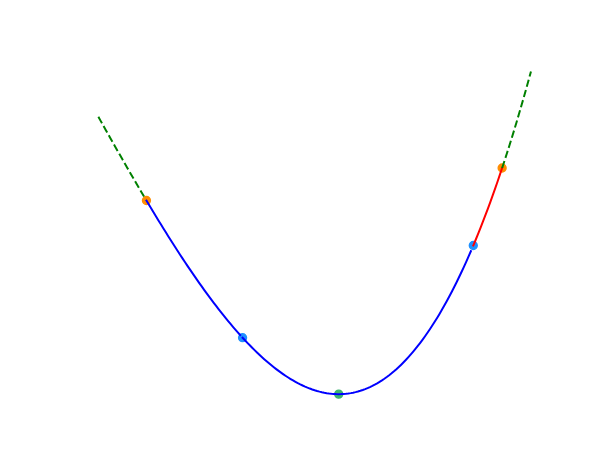

# 二分

## 二分法

### 定义

二分查找，也称折半搜索、对数搜索，是用来在一个有序数组中查找某一元素的算法。

### 过程

以在一个升序数组中查找一个数为例。

它每次考察数组当前部分的中间元素，如果中间元素刚好是要找的，就结束搜索过程；如果中间元素小于所查找的值，那么左侧的只会更小，不会有所查找的元素，只需到右侧查找；如果中间元素大于所查找的值同理，只需到左侧查找。

### 性质

二分查找的最优时间复杂度为 $O(1)$。

二分查找的平均时间复杂度和最坏时间复杂度均为 $O(\log n)$。因为在二分搜索过程中，算法每次都把查询的区间减半，所以对于一个长度为 $n$ 的数组，至多会进行 $O(\log n)$ 次查找。

空间复杂度
迭代版本的二分查找的空间复杂度为 $O(1)$。

递归（无尾调用消除）版本的二分查找的空间复杂度为 $O(\log n)$。

### 实现

```cpp
int binary_search(int start, int end, int key) {
  int ret = -1;  // 未搜索到数据返回-1下标
  int mid;
  while (start <= end) {
    mid = start + ((end - start) >> 1);  // 直接平均可能会溢出，所以用这个算法
    if (arr[mid] < key)
      start = mid + 1;
    else if (arr[mid] > key)
      end = mid - 1;
    else {  // 最后检测相等是因为多数搜索情况不是大于就是小于
      ret = mid;
      break;
    }
  }
  return ret;  // 单一出口
}
```


### 最大值最小化

注意，这里的有序是广义的有序，如果一个数组中的左侧或者右侧都满足某一种条件，而另一侧都不满足这种条件，也可以看作是一种有序（如果把满足条件看做$ 1$，不满足看做$ 0$，至少对于这个条件的这一维度是有序的）。换言之，二分搜索法可以用来查找满足某种条件的最大（最小）的值。

要求满足某种条件的最大值的最小可能情况（最大值最小化），首先的想法是从小到大枚举这个作为答案的「最大值」，然后去判断是否合法。若答案单调，就可以使用二分搜索法来更快地找到答案。因此，要想使用二分搜索法来解这种「最大值最小化」的题目，需要满足以下三个条件：
1. 答案在一个固定的区间内；
2. 可能查找一个符合条件的值不是很容易，但是要求能比较容易地判断某个值是否是符合条件的；
3. 可行解对于区间满足一定的单调性。换言之，如果$x$是符合条件的，那么有$x+1$或$x-1$也符合条件。

## 三分法

### 引入

如果需要求出单峰呢个函数的极值点，通常使用二分法衍生出的三分法求单峰函数的极值点。

三分法和二分法的基本思想类似，但每次操作需在当前区间$[l,r]$（下图中除去虚线范围内的部分）内任取两点$lmid, rmid(lmid\le rmid)$（下图中的两蓝点）。如下图，如果$f(lmid)\le f(rmid)$，则在$[rmid,r]$（下图中的红色部分）中函数必然单调递增，最小值所在点（下图中的绿点）必然不在这一区间，可舍去这一区间。反之亦然。


三分法每次操作会舍去两侧区间中的其中一个。为减少三分法的操作次数，应使两侧区间尽可能大。因此，每一次操作时的 $lmid $和$ rmid $分别取 $mid-\varepsilon $和 $mid+\varepsilon $是一个不错的选择。

```cpp
while (r - l > eps) {
  mid = (l + r) / 2;
  lmid = mid - eps;
  rmid = mid + eps;
  if (f(lmid) < f(rmid))
    r = mid;
  else
    l = mid;
}
```


