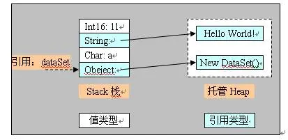

# GC

为什么要使用GC呢？也可以说是为什么要使用内存自动管理？因为：
1. 提高了软件开发的抽象度；
2. 程序员可以将精力集中在实际问题上而不用分心来管理内存的问题；
3. 可以使模块的接口更加的清晰，减小模块间的耦合；
4. 大大减少了内存人为管理不当所带来的Bug；
5. 使内存管理更加高效。
总的来说就是GC可以使程序员从复杂的内存问题中摆脱出来，从而提高了软件开发的速度，质量和安全性。

## 什么是GC

GC，就是垃圾收集，当然这里仅就内存而言。GC以应用程序的root为基础，遍历应用程序在Heap上动态分配的所有对象，通过识别它们是否被引用来确定哪些对象是已经死亡的哪些仍需要被使用。已经不再被应用程序的root或者别的对象所引用的对象就是已经死亡的对象，即所谓的垃圾，需要被回收。这就是GC工作的原理，为了实现这个原理，GC有多种算法，常见的有Reference Counting，Mark Sweep，Copy Collection等等，目前主流的虚拟系统.net CLR，Java VM和Rotor都是采用的Mark Sweep算法。

## 一、Mark-Compact 标记压缩算法

简单把.NET的GC算法看作Mark-Compact算法

阶段1：Mark-Sweep标记清除阶段。
先假设Heap中所有对象都可以回收，然后找出不能回收的对象，给这些对象打上标记，最后Heap中没有被打上标记的对象都是可以被回收的。

阶段2：Compact压缩阶段。
对象回收过后Heap内存空间变得不连续，在Heap中移动这些对象，使得它们重新从Heap基地址开始连续排列，类似于磁盘空间的碎片整理。
](../../../image/GC.png)

Heap内存经过回收、压缩之后，可以继续采用前面的Heap内存分配方法，即仅用一个指针记录Heap分配的起始地址就可以。

主要处理步骤：将线程挂起=>确定roots=>创建reachable objects graph=>对象回收=>Heap压缩=>指针修复

可以这样理解roots：Heap中对象的引用关系错综复杂（交叉引用、循环引用）（例如对象A的引用存储在栈中，其值指向堆中的对象B，而对象B的值又指向堆中的对象C，那么这就形成了多层引用的现象），形成复杂的graph，roots是CLR在Heap之外可以找到的各种入口点。GC搜索roots的地方包括全局对象、静态变量、局部对象、函数调用参数、当前CPU寄存器中的对象指针（还有finalizationqueue）等。主要可以归为2种类型：已经初始化了的静态变量、线程仍在使用的对象（stack+CPU register）。

Reachable objects：指根据对象引用关系，从roots出发可以到达的对象，例如当前执行函数的局部变量对象A是一个rootobject，他的成员变量引用了对象B，则B是一个reachable object。从roots出发可以创建reachable object graph，剩余对象即为unreachable，可以被回收。

](../../../image/GC2.png)

指针修复是因为compact过程移动了Heap对象，对象地址发生变化，需要修复所有引用指针，包括stack、CPU register中的指针以及Heap中其他对象的引用指针。

Debug和release执行模式之间稍有区别，release模式下后续代码没有引用的对象是unreachable的，而debug模式下需要等到当前函数执行完毕，这些对象才会成为unreachable，目的是为了调试时跟踪局部对象的内容。

传给了COM+的托管对象也会成为root，并且具有一个引用计数器以兼容COM+的内存管理机制，引用计数器为0时这些对象才可能成为被回收对象。

Pinned objects指分配过后不能移动位置的对象，例如传递给非托管代码的对象（或者使用fixed关键字），GC在指针修复时无法修改非托管代码中的引用指针，因此将这些对象移动将发生异常，pinned object会导致Heap出现碎片，但大部分情况来说传给非托管代码的对象应当在GC时能够被回收掉。

## 二、Generational 分代算法

程序可能使用几百M、几G的内存，对这样的内存区域进行GC操作成本很高，分代算法具备一定统计学基础，对GC的性能改善效果比较明显。

将对象按照生命周期分成新的、老的，根据统计分布规律所反映的结果，可以对新、老区域采用不同的回收策略和算法，加强对新区域的回收处理力度，争取在较短时间间隔、较小的内存区域内，以较低成本将执行路径上大量新抛弃不再使用的局部对象及时回收掉。
分代算法的假设前提条件：
1. 大量新创建的对象生命周期都比较短，而较老的对象生命周期会更长。
2. 对部分内存进行回收比基于全部内存的回收操作要快。
3. 新创建的对象之间关联程度通常较强，Heap分配的对象是连续的，关联度较强有利于提高CPU cache的命中率。

.NET将Heap分成3个代龄区域：Gen0，Gen1，Gen2
](../../../image/GC3.png)

Heap分为3个代龄区域，相应的GC有3种方式：#Gen 0 collections，#Gen 1 collections，#Gen 2 collections。如果Gen 0 Heap内存达到阈值，则触发0代GC，0代GC后Gen 0中幸存的对象进入Gen 1。如果Gen 1的内存达到阈值，则进行1代GC，1代GC将Gen 0 Heap和Gen 1 Heap一起进行回收，幸存的对象进入Gen 2。2代GC将Gen 0 Heap、Gen 1 Heap和Gen 2 Heap一起回收Gen 0和Gen 1比较小，这两个代龄加起来总是保持在16M左右；Gen2的大小由应用程序确定，可能达到几G，因此0代和1代GC的成本非常低，2代GC称为fullGC，通常成本很高。粗略的计算0代和1代GC应当能在几毫秒到几十毫秒之间完成，Gen 2 Heap比较大时fullGC可能需要花费几秒时间。大致上来讲.NET应用运行期间2代、1代和0代GC的频率大致为1:10:100。

## 三、Finalizaton Queue和Freachable Queue

这两个队列和.NET对象所提供的Finalize方法有关，这两个队列并不用于存储真正的对象，而是存储一组指向对象的指针。当程序中使用了new操作符在Managed Heap上分配空间时，GC会对其进行分析，如果该对象含有Finalize方法则在Finalization Queue中添加一个指向该对象的指针。在GC被启动以后，经过Mark阶段分辨出哪些是垃圾。再在垃圾中搜索，**如果发现垃圾中有被Finalization Queue中的指针所指向的对象**，则将这个对象从垃圾中分离出来，并将指向它的指针移动到Freachable Queue中。这个过程被称为是对象的复生（Resurrection），本来死去的对象就这样被救活了。为什么要救活它呢？**因为这个对象的Finalize方法还没有被执行**，所以不能让它死去。Freachable Queue平时不做什么事，但是一旦里面被添加了指针之后，它就会去触发所指对象的Finalize方法执行，之后将这个指针从队列中剔除，这时这个对象就可以安静的死去了。.NET framework的`System.GC`类提供了控制Finalize的两个方法，ReRegisterForFinalize和SuppressFinalize。前者是请求系统完成对象的Finalize方法，后者是请求系统不要完成对象的Finalize方法。ReRegisterForFinalize方法其实就是将指向对象的指针重新添加到Finalization Queue中。这就出现了一个很有趣的现象，因为在Finalization Queue中的对象可以复生，如果在对象的Finalize方法中调用了ReRegisterForFinalize方法，这样就形成了一个在堆上永远不会死去的对象，像凤凰涅槃一样每次死的时候都可以复生。

## 托管资源

NET中的所有类型都是（直接或间接）从`System.Object`类派生的。

CTS中的类型被分为两大类-引用类型（reference type，又叫托管类型[managed type]），分配在内存堆上，值类型（value type）。值类型分配在堆栈上，如图：

](../../../image/GC4.png)

值类型在栈里，先进后出，值类型变量的生命有先后顺序，这个确保了值类型变量在退出作用域以前会释放资源。比引用类型更简单和高效。堆栈是从高地址往低地址分配内存。

引用类型分配在托管堆（Managed Heap）上，声明一个变量在栈上保存，当使用new 创建对象时，会把对象的地址存储在这个变量里。托管堆相反，从低地址往高地址分配内存。如图：



.NET中超过80%的资源都是托管资源。

## 非托管资源

`ApplicationContext`,`Brush`,`Component`,`ComponentDesigner`,`Container`,`Context`,`Cursor`,`FileStream`,`Font`,`Icon`,`Image`,`Matrix`,`Object`,`OdbcDataReader`,`OleDBDataReader`,`Pen`,`Regex`,`Socket`,`StreamWriter`,`Timer`,`Tooltip`。文件句柄，GDI资源，数据库连接，非托管代码（如c/c++编写的库）等等资源。

## .NET的GC机制问题

首先，GC并不能释放所有的资源，它不能自动释放非托管资源。

第二，GC并不是实时性的，这将会造成系统上的瓶颈和不确定性。

所以有了`IDisposable`接口，`IDisposable`接口定义了`Dispose`方法，这个方法用来供程序员显式调用以释放非托管资源。使用using语句可以简化资源管理。
例如：
```c#
using System;
using System.IO;

class Program
{
    static void Main()
    {
        // 在 using 语句块中创建FileStream对象
        using (FileStream fileStream = new FileStream("example.txt", FileMode.Open))
        {
            // 在这里可以对文件进行读取或写入操作

            Console.WriteLine("File operations completed");

        } // 当代码块执行离开 using 语句块时，会自动调用fileStream.Dispose()方法来释放资源。
    }
}
```

## GC.Collect()方法

作用：强制进行垃圾回收

## 注意

1. 只管理内存，非托管资源，需要使用Dispose。
2. 循环引用，网状结构等的实现会变得简单，GC的标志，压缩算法能有效的检测这些关系，并将不再被引用的网状结构整体删除。
3. GC通过从程序的根对象开始遍历来检测一个对象是否可被其他对象访问，而不是用类似于COM中的引用计数方法。
4. GC在一个独立的线程中运行来删除不再被引用的内存。
5. GC每次运行时会压缩托管堆。
6. 你必须对非托管资源的释放负责，可以通过在类型中定义Finalizer来保证资源得到释放。
7. 对象的Finalizer被执行的时间是在对象不再被引用后的某个不确定的时间。注意并非和C++中一样在对象超出声明周期时立即执行析构函数。（因为会复生放在Freachable Queue中等待执行）。
8. Finalizer的使用有性能上的代价。需要Finalization的对象不会立即被清除，而需要先执行Finalizer.Finalizer不是在GC执行的线程中调用。GC把每一个需要执行Finalizer的对象放到一个队列中去，然后启动另一个线程来执行所有这些Finalizer。而GC线程继续去删除其他待回收的对象。在下一个GC周期，这些执行完Finalizer的对象的内存才会被回收。
9. .NET GC使用“代”这个概念来优化性能，代帮助GC更迅速的识别那些最可能成为垃圾的对象。在上次执行完垃圾回收后新创建的对象为第0代对象，经历了一次GC周期的对象为第1代对象，同样二次为2代对象。代的作用是为了区分局部变量和需要在应用程序生存周期中一直存活的对象。大部分第0代对象是局部变量。而成员变量和全局变量很快变成第1代对象并最终成为第2代对象。
10. GC对不同代的对象执行不同的检查策略以优化性能。每个GC周期都会检查第0代对象。大约1/10的GC周期检查第0代和第1代对象。大约1/100的GC周期检查所有对象，重新思考Finalization的代价：需要Finalization的对象可能比不需要Finalization在内存中停留额外9个GC周期，如果此时它还没有被Finalize，就变成2代对象，从而在内存中停留更长时间。


