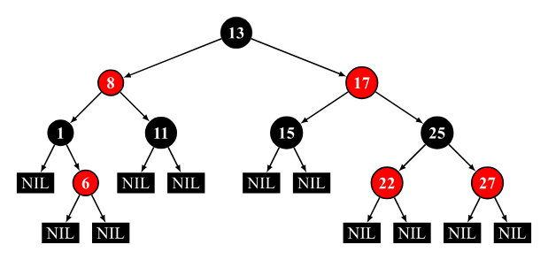

# 红黑树

红黑树是一种自平衡的二叉搜索树，每个节点额外存储了一个color字段（“RED”or“BLACK”），用于确保树再插入和删除时保持平衡。

## 性质

一棵合法的红黑树必须遵循以下四条性质：
1. 节点为红色或黑色。
2. $NIL$节点（空叶子节点）为黑色。
3. 红色节点的子节点为黑色。
4. 从根节点到$NIL$节点的每条路径上的黑色节点数量相同。

下图为一棵合法的红黑树：


注：部分资料中还加入了第五条性质，即根节点必须为黑色，这条性质要求完成插入操作后若根节点为红色则将其染黑，但由于将根节点染黑的操作也可以延迟至删除操作时进行，因此，该条性质并非必须满足。

## 结构

### 红黑树的定义

```c++
template<typename Key, typename Value, typename Compare = std::less<Key>>
Class RBTreeMap {
    //排序函数
    Compare compare = Compare();

    //节点结构体
    struct Node {
        ...
    };

    //根节点指针
    Node* root = nullptr;
    //记录红黑树中当前的节点个数
    size_t count = 0;
};
```

### 节点维护的信息

|Identifier|Type|Description|
|----------|----|-----------|
|`left`|`Node*`|左子节点指针|
|`right`|`Node*`|右子节点指针|
|`parent`|`Node*`|父节点指针|
|`color`|`enum{BLACK,RED}`|颜色枚举|
|`key`|`Key`|节点键值，具有唯一性和可排序性|
|`value`|`Value`|节点内存储的值|

注：由于本文提供的代码示例中使用`std::share_ptr`进行内存管理，对此不熟悉的可以将下文中所有`NodePtr`和`ConstNodePtr`理解为裸指针`Node*`。但在实现删除操作时若使用`Node*`作为节点引用需要注意手动释放内存以避免内存泄漏，该操作在使用`std::shared_ptr`作为节点引用的示例代码中并未体现。
