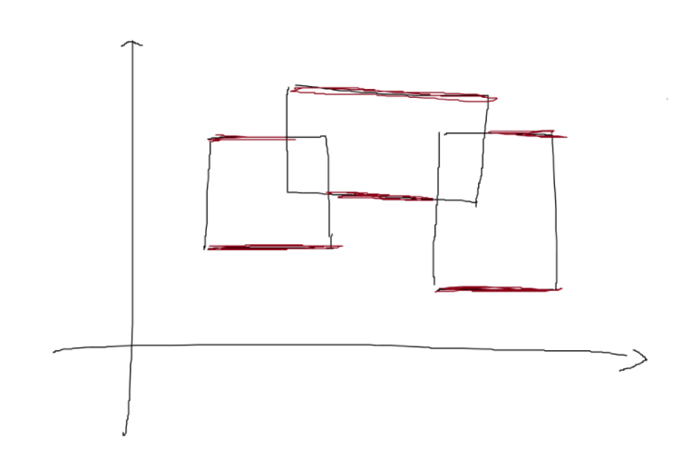
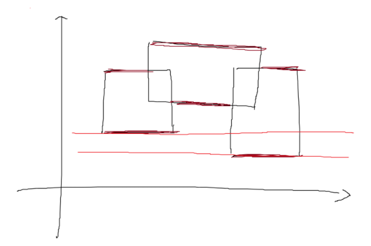

# 扫描线

## 引入

扫描线一般运用在图形上面，它和它的字面意思十分相似，就是一条线在整个图上扫来扫去，它一般用来解决图形面积，周长，以及二维数点等问题。

## Atlantis问题

### 题意

在二维坐标系上，给出多个矩形的左下以及右上坐标，求出所有矩形构成的图形的面积

### 解法

根据图片可知总面积可以直接暴力即可求出面积，如果数据大了怎么办？这时就需要用到**扫描线**算法。

### 过程

现在假设我们有一根线，从下往上开始扫描：


- 如图所示，我们可以把整个矩形分成如图各个颜色不同的小矩形，那么这个小矩形的高就是我们扫过的距离，那么剩下了一个变量，那就是矩形的长一直在变化。
- 我们的线段树就是为了维护矩形的长，我们给每一个矩形上下边进行标记，下面的边标记为$1$，上面的边标记为$-1$，每遇到一个矩形时，我们知道了标记为$1$的边，我们就加进来这一条矩形的长，等到扫描到$-1$时，证明这一条边需要删除，就删去，利用$1$和$-1$可以轻松的到这种状态。
- 还要注意这里的线段树指的并不是线段的一个端点，而指的是一个区间，所以我们要计算的是$r+1$和$r-1$。
- 需要离散化

### 实现

```c++
#include <iostream>
#include <cstring>
#include <algorithm>
using namespace std;
#define lson root<<1
#define rson root<<1|1
#define mid (l+r)/2
#define maxn 300
using namespace std;

int lazy[maxn << 2];
double s[maxn << 2];

struct node1 {
    double l, r;
    double sum;
} tree[maxn << 2];

struct node2 {
    double y, x1, x2;
    int flag;
} p[maxn << 2];

bool cmp(node2 a, node2 b) {
    return a.y < b.y || (a.y == b.y && a.flag > b.flag);
}

void pushup(int root) {
    if (lazy[root] > 0) {
        tree[root].sum = tree[root].r - tree[root].l;
    } else {
        tree[root].sum = tree[lson].sum + tree[rson].sum;
    }
}

void build(int root, int l, int r) {
    if (r - l > 1) {
        tree[root].l = s[l];
        tree[root].r = s[r];
        build(lson, l, mid);
        build(rson, mid, r);
        pushup(root);
    } else {
        tree[root].l = s[l];
        tree[root].r = s[r];
        tree[root].sum = 0;
    }
}

void update(int root, double x1, double x2, int flag) {
    if (tree[root].l == x1 && tree[root].r == x2) {
        lazy[root] += flag;
        pushup(root);
        return;
    } else {
        if (tree[lson].r > x1) update(lson, x1, min(tree[lson].r, x2), flag);
        if (tree[rson].l < x2) update(rson, max(tree[rson].l, x1), x2, flag);
        pushup(root);
    }
}

int main() {
  int temp = 1, n;
  double x1, y1, x2, y2, ans;
  while (scanf("%d", &n) && n) {
    ans = 0;
    for (int i = 0; i < n; i++) {
      scanf("%lf %lf %lf %lf", &x1, &y1, &x2, &y2);
      p[i].y = y1;
      p[i].x1 = x1;
      p[i].x2 = x2;
      p[i].flag = 1;
      p[i + n].y = y2;
      p[i + n].x1 = x1;
      p[i + n].x2 = x2;
      p[i + n].flag = -1;
      s[i + 1] = x1;
      s[i + n + 1] = x2;
    }
    sort(s + 1, s + (2 * n + 1));  // 离散化
    sort(p, p + 2 * n, cmp);  // 把矩形的边的横坐标从小到大排序
    build(1, 1, 2 * n);       // 建树
    memset(lazy, 0, sizeof(lazy));
    update(1, p[0].x1, p[0].x2, p[0].flag);
    for (int i = 1; i < 2 * n; i++) {
      ans += (p[i].y - p[i - 1].y) * tree[1].sum;
      update(1, p[i].x1, p[i].x2, p[i].flag);
    }
    printf("Test case #%d\nTotal explored area: %.2lf\n\n", temp++, ans);
  }
  return 0;
}
```
[Atlantis](http://poj.org/problem?id=1151)

## 矩形周长

### 基本思想

比如，对于下面的三个矩形


想象有一条扫描线，从下往上扫描完整个图案，每遇到一条上边或者下边就停下来：


然后每次停下后对区间进行处理，用一个$ans$代表当前周长，最后$ans$就是答案。

### 实现

首先，要先把矩形拆成上边和下边，用$1$和$-1$分别代表下边和上边，然后按高度排序，这样数组从前往后处理就相当于扫描线从下往上扫描，如果是下边，就在对应区间上加$1$，如果是上边，就在对应区间上减$1$。

在整个区间上建一棵线段树：
```c++
#define lson o<<1
#define rson o<<1|1
#define mid (l+r)/2

struct Tree {
    int sum;//整个区间被整体覆盖了几次（类似lazytag，但不下传)
    int num;//整个区间被几条互不相交的线段覆盖（比如，[1,2],[4,5]则为2，[1,3],[4,5]则为1（我习惯用闭区间），[1,4],[2,2],[4,4]也为1）
    int len;//整个区间被覆盖的总长度
    bool lflag;//左端点是否被覆盖（合并用）
    bool rflag;//右端点是否被覆盖（合并用）
};
```

其他可以参照Atlantis解法，如何计算周长呢？

横线的长度=现在这次总区间被覆盖的长度和上一次总区间被覆盖长度之差的绝对值。

例如第一条和第二条之差可以得出第二个横线周长。

那么竖线长度如何获得呢？

如果我们已知当前区间被几条**不相交**的线段覆盖，那么我们就可以知道当前竖线的总周长。
举个例子，num=1，可以知道竖线只有两条，只需要`(p[i].y - p[i - 1].y) * 2`即可。如果num=2，竖线则有四条，这是显而易见的。如下图：


