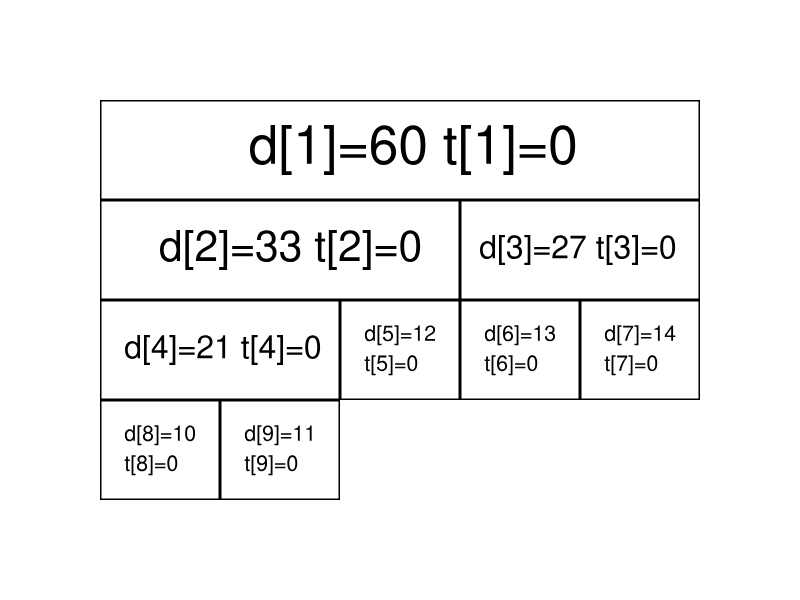
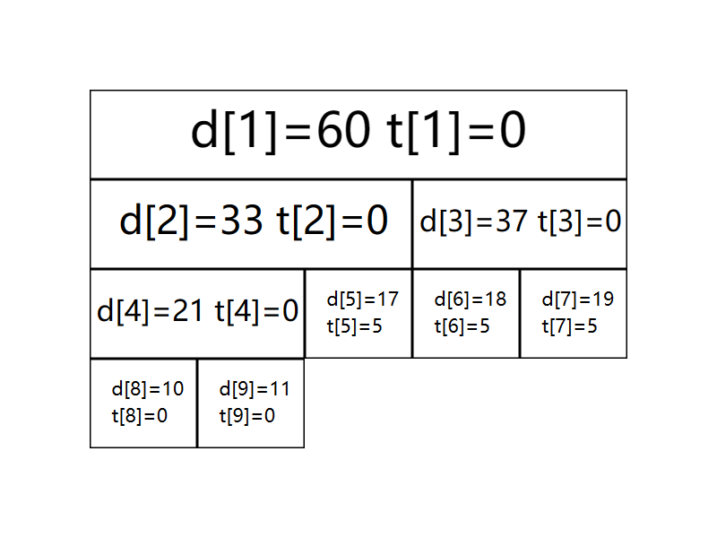

# 线段树

## 引入

线段树是常用来维护**区间信息**的数据结构。

线段树可以在$O(logN)$的时间复杂度内实现单点修改、区间修改、区间查询（区间求和，求区间最大值，求区间最小值）等操作。

## 线段树

### 线段树的基本结构与建树

#### 过程

线段树将每个长度不为$1$的区间划分成左右两个区间递归求解，把整个线段划分为一个树形结构，通过合并左右两个区间信息来求得该区间得信息。这种数据结构可以方便的进行大部分的区间操作。

有个大小为$5$的数组$a=\{10,11,12,13,14\}$，要将其转化为线段树，有以下做法：设线段树的根节点编号为$1$，用数组$d$来保存线段树，$d_{i}$用来保存线段树上编号为$i$的节点的值（这里每个节点所维护的值就是这个节点所表示的区间总和）。

我们先给出这棵线段树的形态，如下图所示：


图中每个节点中用红色字体标明的区间，表示该节点管辖的$a$数组上的区间，如$d_{1}$所管辖的区间就是$[1,5]$，即$d_1$所保存的值是$a_1+a_2+a_3+a_4+a_5$，$d_1=60$，表示其和为$60$。

通过观察不难发现，$d_i$的左儿子节点就是$d_{2i}$，$d_i$的右二子节点就是$d_{2i+1}$。如果$d_i$表示的是区间$[s,t]$（即$d_i=a_s+a_{s+1}+...+a_{t}$）的话，那么$d_i$的左儿子节点表示的是区间$[s,\frac{s+t}{2}]$，$d_i$的右二子表示的是区间$[\frac{s+t}{2} + 1, t]$。

在实现时，我们考虑递归建树。设当前根节点为$p$，如果根节点管辖的区间长度已经是$1$，则可以直接根据$a$数组上相应位置的值初始化该节点。否则我们将该区间从中点处分割为两个子区间，分别进入左右子节点递归建树，最后合并两个子节点的信息。

#### 实现

```c++
void build(int s, int t, int p) {
    //当前根的编号是 p 对应管辖区间为[s,t]
    if (s == t) {
        d[p] = a[s];
        return;
    }
    int mid = (s + t) / 2;
    build(s, mid, p << 1);
    build(mid + 1, t, (p << 1) + 1);
    d[p] = d[p << 1] + d[(p << 1) + 1];
}
```

关于线段树的空间，如果采用堆式存储（$2p$是$p$的左儿子，$2p+1$是$p$的右二子），若有$n$个叶子结点，则$d$数组的范围最大为$2^{\lceil logn\rceil +1}$。

分析：容易知道线段树的深度是$\lceil logn\rceil$的，则在堆式存储情况下叶子节点（包括无用的叶子节点）数量为$2^{\lceil logn\rceil}$个，又由于其为一棵完全二叉树，则其总节点个数为$2^{\lceil logn\rceil + 1}-1$。当然如果懒得计算可以直接把数组长度设置为$4n$，因为$\frac{2^{\lceil logn\rceil}-1}{n}$的最大值在$n=2^x+1(x\in N_{+})$时取到，此时节点数为$2^{\lceil logn\rceil + 1} -1 = 2^{x+2}-1=4n-5$

### 线段树的区间查询

#### 过程

区间查询，比如求区间$[l,r]$的总和（即$a_{l}+a_{l+1}+...+a_r$），求区间最大值/最小值等操作。


仍然以最开始的图为例，如果要查询区间$[1,5]$的和，那么直接取$d_1$的值($60$)即可。

如果要查询的区间为$[3,5]$，此时就不能直接获取区间的值，但是$[3,5]$可以拆分成$[3,3]$和$[4,5]$，可以通过合并这两个区间的答案来求得这个区间的答案。

一般地，如果要查询的区间是$[l,r]$，则可以将其拆分成最多为$O(logn)$个**极大**的区间，合并这些区间即可求出$[l,r]$的答案。

#### 实现

```c++
int getsum(int l, int r, int s, int t, int p) {
    // 节点编号 p 对应管辖的区间[s,t] 要查找[l,r]的和
    if (l <= s && t <= r) {
        return d[p];
    }
    int mid = (s + t) / 2;
    int sum = 0;
    if (l <= mid) sum = getsum(l, r, s, mid, p << 1);
    if (mid < r) sum += getsum(l, r, mid + 1, t, (p << 1) + 1);
    return sum;
}
```

### 线段树的区间修改与懒标记

#### 过程

如果要求修改区间$[l,r]$，把所有包含在区间$[l,r]$中的节点都遍历一遍，修改一遍，时间复杂度无法承受，我们这里引入一个$\lceil 懒惰标记 \rfloor$的东西。

懒惰标记，简单来说，就是通过延迟对节点信息的更改，从而减少可能不必要的操作次数。每次执行修改时，我们通过打标记得方法表明该节点对应得区间在某一次操作中被更改，但不更新该节点得子节点信息，实质性的修改则在下一次访问带有标记的节点时才进行。

仍然以最开始的图为例，我们将执行若干次给区间内的数加上一个值的操作，我们现在给每个节点增加一个$t_i$，表示该节点带的标记值。

最开始时的情况如下：


现在我们准备给$[3,5]$上的每个数都加上$5$。根据前面区间查询的经验，我们很快找到了两个极大区间$[3,3]$和$[4,5]$（分别对应线段树上的$3$号点和$5$号点）。

我们直接在这两个节点上进行修改，并给它们打上标记；


我们发现，$3$号节点的信息虽然被修改了（因为该区间管辖两个数，所以$d_3$加上的数是$5×2=10$），但它的两个子节点却还没有更新，仍然保留着修改之前的信息。不过不用担心，虽然修改目前还没进行，但当我们要查询这两个子节点的信息时，我们会利用标记修改这两个子节点的信息，使查询的结果依旧准确。

接下来我们查询一下$[4,4]$区间上的和。

我们通过递归找到$[4,5]$区间，发现该区间并非我们的目标区间，且该区间上存在标记，这时候就到了标记下放的时间了，我们将该区间的两个子区间的信息更新，并清除该区间上的标记。


现在$6,7$两个节点的值变为了最新的值，查询的结果也是准确的。

#### 实现

接下来给出存在标记的情况下，区间修改和查询操作的参考：

```c++
void update(int l, int r, int c, int s, int t, int p) {
    //编号 p 管辖区间[s,t] 需要修改[l,r]区间的值 变化量为c
    if (l <= s && t <= r) {
        d[p] += (t - s + 1) * c;
        lazy[p] += c; //懒标记
        return;
    }
    int mid = (s + t) / 2;
    if (lazy[p] && s != t) {
        // 只有当前懒标记不为空 且 有子节点 才修改子节点 和下放 lazy
        d[p << 1] += (mid - s + 1) * lazy[p]; 
        d[(p << 1) + 1] += (t - mid) * lazy[p];
        lazy[p << 1] += lazy[p];
        lazy[(p << 1) + 1] += lazy[p];
        lazy[p] = 0;
    }
    if (l <= mid) update(l, r, c, s, mid, p << 1);
    if (mid < r) update(l, r, c, mid + 1, t, (p << 1) + 1);
    d[p] = d[p << 1] + d[(p << 1) + 1];
}

```

```c++
int getsum(int l, int r, int s, int t, int p) {
    // 编号 p 管辖区间[s,t] 需要查询区间[l,r]
    if (l <= s && t <= r) {
        return d[p];
    }
    int mid = (s + t) / 2;
    if (lazy[p] && s != t) {
        d[p << 1] += (mid - s + 1) * lazy[p]; 
        d[(p << 1) + 1] += (t - mid) * lazy[p];
        lazy[p << 1] += lazy[p];
        lazy[(p << 1) + 1] += lazy[p];
        lazy[p] = 0;
    }
    int sum = 0;
    if (l <= mid) sum = getsum(l, r, s, mid, p << 1);
    if (mid < r) sum += getsum(l, r, mid + 1, t, (p << 1) + 1);
    return sum;
}

```