# TCP/IP

TCP/IP是互联网相关的各类协议族的总称，比如：TCP，UDP，IP，FTP，HTTP，ICMP，SMTP等都属于TCP/IP族内的协议，像这样把与互联网相关联的协议集合起来总称为TCP/IP，也有说法认为，TCP/IP指TCP和IP这两种协议，也有指在IP协议通信过程中，使用到的协议族统称。

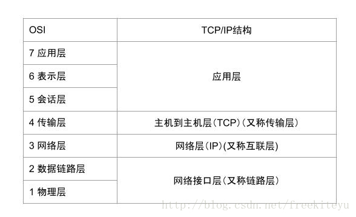

- OSI参考模型

OSI参考模型是ISO的建议，它是为了使各层上的协议国际标准化而发展起来的，OSI参考模型全称是开放系统互连参考模型（Open System Interconnection Reference Model），这一参考模型分为七层。

- TCP/IP参考模型

TCP/IP参考模型是首先由ARPANET所使用的网络体系结构，这个体系结构在它的两个主要协议出现以后被称为TCP/IP参考模型（TCP/IP Reference Model）。这一网络协议分为四层：数据链路层，网络层，传输层，应用层。

# TCP/IP的分层管理

TCP/IP协议族里最重要的一点就是分层，把TCP/IP层次化是有好处的，例如，如果互联网只由一个协议统筹，某个地方需要改变设计时，就必须把所有部分整体替换掉。而分层之后只需把变动的层替换掉即可。把各层之间的接口部分规划好之后，每个层次内部的设计就能自由改动。

# 计算机如何通信

如图，为网络通信的五层模型：

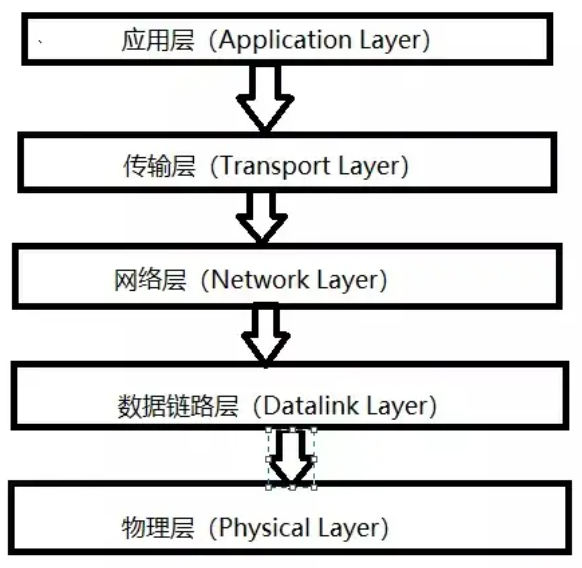

## 物理层

一台计算机与另一台计算机要进行通信，第一件要做的事是什么？即把这台计算机与另一台计算机连接起来，这样，我们才能把数据传输过去，例如通过光纤，电缆，双绞线等介质把他们连接起来，然后才能通信。

也就是说，物理层负责把两台计算机连接起来，然后在计算机之间通过高低电频来传送0，1这样的电信号。

## 数据链路层

前面说了，物理层只是单纯的让两个计算机连接起来，并且传输01电信号，如果这些01电信号组合的传送毫无规则，计算机无法解读。

因此，我们需要制定一套规则来进行0，1的传送。例如多少个电信号为一组，每一组信号应该如何标识。

### 以太网协议

以太网协议规定，一组电信号构成一个数据包，我们把这个数据包称之为帧，每一个帧由标头和数据两部分组成。

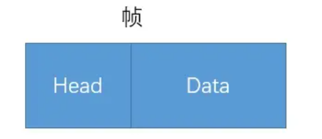

帧的大小一般为64~1518个字节，假如需要传送的数据很大的话，就分成多个帧来进行传送。

对于标头和数据这两部分，他们存放的都是一些什么数据呢？首先我们得知道这个帧是谁发送的，发送给谁的等信息。因此标头部分主要是一些说明数据，例如发送者，接收者的信息，而数据部分则是这个数据包具体的，想给接收者的内容。

一个帧的长度64~1518字节，也就是说每个帧的长度不固定，但是标头是固定的，为18字节。

把一台计算机的数据通过物理层和链路层发送给另一个计算机，究竟是谁发送给谁，计算机与计算机之间如何区分，于是MAC地址出现了。

### MAC地址

连入网络的每一个计算机都会有网卡接口，每个网卡都会有一个唯一标识的地址，这个地址就叫做MAC地址，计算机之间的数据传送，就是通过MAC地址来唯一寻找、传送的。

MAC地址由48个字节所构成，在网卡生产时就被唯一标识了。

### 广播与ARP协议

假如，有四个计算机被连接起来，分别是ABCD。如果计算机A知道了计算机B的MAC地址，然后计算机A想要给计算机B传送数据，虽然计算机A知道了计算机B的MAC地址，可是它要怎么给它传送数据呢？计算机A不仅连接着计算机B还连接着其它的计算机。虽然计算机A知道计算机B的MAC地址，可是计算机A不知道计算机B分布在哪一条线路，于是有了广播的出现。

在同一个子网中，计算机A要向计算机B发送一个数据包，这个数据包会包含接收者的MAC地址，当发送时，计算机A是通过广播的方式发送的，这时同一个子网中的计算机CD也会收到这个数据包，然后收到这个数据包的计算机，会把数据包的MAC地址取出来，与自身的MAC地址对比，如果两者相同，则接收这个数据包，否则就丢弃这个数据包，这种发送方式我们称之为广播，就像在广场上喊人，所有人可以听见，但只有是这个名字的人才会搭理。

那么问题来了，计算机A如何知道计算机B的MAC地址呢？这时候就得由ARP协议解决，ARP会涉及到IP地址，此处先了解ARP可以获得子网中其它计算机的MAC地址。

## 网络层

上面有说到子网这个关键词，实际上我们所处的网络是由无数个子网络构成的，广播的时候，也只有同一个子网里面的计算机能够收到。

假如没有子网这种划分的话，计算机A通过广播的方式发送一个数据包给计算机B，其它所有计算机也都能收到这个数据包，然后进行对比再舍弃。假如没有子网，那么每一台计算机都能收到其它计算机发送的数据包，那么对网络的压力非常大，因此才有了子网。

那么我们如何区分哪些MAC地址属于同一个子网呢？假如是同一个子网，那么我们就用广播的形式把数据传送给对方，如果不是同一个子网，我们就把数据发送给网关，让网关进行转发。

### IP协议

IP协议，它所定义的地址，我们称之为IP地址，IP协议有两种版本，一种是IPV4，另一种是IPV6.不过我们目前大多数使用的还是IPV4。此处只讨论IPV4协议。

这个IP地址由32位的二进制数组成，我们一般使用4段十进制表示，地址范围为：0.0.0.0~255.255.255.255。

每一台想要联网的计算机都会有一个IP地址。这个IP地址被分为两部分，前面一部分代表网络部分，后面一部分代表主机部分，并且网络部分和主机部分所占用的二进制位是不固定的。

假如两台计算机的网络部分是一模一样的，我们就说这两台计算机是处于同一个子网中，例如192.168.43.1和192.168.43.2，假如这两个IP地址的网络部分都是24位，主机部分8位，那么他们的网络部分都是192.168.43，所以他们处于同一个子网当中。

可是问题来了，我们如何知道网络部分是占几位呢？也就是说单单凭借IP地址还无法判断两个计算机是否处于同一个子网当中。

这就出现了另一个关键词——子网掩码，子网掩码和IP地址一样是一个32位二进制数，不过它的网络部分规定全部为1，主机部分规定全是0，也就是说，假如上面两个IP地址的网络部分都是24位，那么他们的子网掩码都是255.255.255.0。

那有了子网掩码，如何来判断IP地址是否处于同一个子网当中呢，显然，知道了子网掩码，相当于我们知道了网络部分是几位，主机部分是几位，我们只需要把IP地址与它的子网掩码进行逻辑与运算，然后把各自的结果进行比较即可。如果比较的结果相同，则代表是同一个子网，否则不是。

例如，192.168.43.1和192.168.43.2的子网掩码都是255.255.255.0，把IP地址与子网掩码进行逻辑与，可以得到他们都为192.168.43.0，进而知道他们在同一个子网中。

A类IP地址 1.0.0.0 ~ 127.0.0.0
B类IP地址 128.1.0.0 ~ 191.254.0.0
C类IP地址 192.0.1.0 ~ 223.255.254.0
D类IP地址 224.0.0.0 ~ 239.255.255.255 用于多点广播
E类IP地址 保留

### ARP协议

有了上面的IP协议知识，回来再看ARP协议。

有了两台计算机的IP地址和子网掩码，我们可以轻而易举的判断它们是否在同一个子网当中。

假如它们处于同一个子网之中，计算机A要给计算机B发送数据时，我们可以通过ARP协议来得到计算机B的MAC地址。

ARP协议也是通过广播的形式给同一个子网中的每台计算机发送一个数据包（当然，这个数据包会包含接收方的IP地址），对方收到这个数据包之后，会取出IP地址与自身对比，如果相同，则把自己的MAC地址回复给对方，否则就丢弃这个数据包，这样计算机A就能知道计算机B的MAC地址了。

知道了MAC地址之后，发送数据是通过广播的形式放发送，询问对方的MAC地址也是通过广播的形式来发送。那其它计算机怎么知道你是要传送数据还是询问MAC地址呢？其实在询问MAC地址的数据包中，在对方MAC地址一栏中，填的是一个特殊的MAC地址，其它计算机看到这个特殊的MAC地址之后，就能知道广播想干嘛了。

### DNS服务器

这里再说一个问题，MAC地址是通过知道对方IP地址通过ARP获得的，那么对方IP地址又是如何获得的呢？当我们想要访问某个网站的时候，我们可以输入IP来进行访问，但是大多数一定是输入网址域名来访问，例如百度wwww.baidu.com，其实当我们输入这个域名后，会有一个叫做DNS服务器来帮我们解析这个域名，然后返回这个域名对应的IP给我们。

因此，网络层的功能就是让我们找到对方计算机在哪，是否属于一个子网等。

## 传输层

通过物理层，数据链路层以及网络层的互相帮助，我们已经把数据成功从计算机A传送到计算机B了，可是，计算机B里面有各种各样的应用程序，计算机该如何知道这些数据是给谁的呢？

这个时候，端口（Port）就出现了，也就是说，我们在从计算机A传送数据给计算机B的时候，我们还得指定一个端口，以供特定的应用程序来接收处理。

也就是说，传输层的功能就是建立端口到端口的通信，相比网络层的功能是建立主机到主机的通信。

只有有了IP和端口，我们才能准确的通信，这个时候或许会问，我们输入IP地址的时候并没有指定端口，其实有些传输协议，已经有预先定义好的默认端口，例如http的80端口，socks的1080端口，FTP的21端口，Telnet的23端口，https的443端口。

传输层最常见的两大协议是TCP协议和UDP协议，其中TCP协议与UDP最大的不同就是TCP提供可靠的传输，而UDP提供的是不可靠传输。

### UDP协议

UDP（User Datagram Protocol，用户数据报协议），UDP是传输层协议，功能即为在IP的数据报服务之上增加了最基本的服务：复用和分用以及差错检测。

UDP提供不可靠服务，具有TCP所没有的优势：

- UDP无连接，时间上**不存在建立连接需要的时延**。空间上，TCP需要在端系统中维护连接状态，需要一定的开销，此连接装入包括接收和发送缓存，拥塞控制参数和序号与确认号的参数。UDP不维护连接状态，也不跟踪这些参数，开销小。空间和时间上都具有优势。举个例子：DNS如果运行在TCP之上而不是UDP，那么DNS的速度将会慢很多。HTTP使用TCP而不是UDP，是因为对于基于文本数据的Web网页来说，可靠性很重要，同一种专用应用服务器在支持UDP时，一定能支持更多的活动客户机。
- 分组首部开销小，TCP首部20字节，UDP首部8字节。
- UDP没有拥塞控制，应用层能够更好的控制要发送的数据和发送时间，网络中的拥塞控制也不会影响主机的发送速率，某些实时应用要求以稳定的速度发送，能容忍一些数据的丢失，但是不能允许有较大的时延（比如实时视频、直播等）。
- UDP提供尽最大努力交付，不保证可靠交付，所有维护传输可靠性的工作需要用户在应用层来完成，没有TCP的确认机制、重传机制，如果因为网络原因没有传送到对端，UDP也不会给应用层返回错误信息。
- UDP是**面向报文**的，对应用层交下来的报文，添加首部后直接向下交付IP层，既不合并，也不拆分，保留这些报文的边界，对IP层交上来的UDP用户数据报，在去除首部后就原封不动地交付给应用进程，报文不可分割，是UDP数据报处理的最小单位。正是因为这样，UDP显得不够灵活，不能控制读写数据的次数和数量，比如我们要发送100个字节的报文，我们调用一次sendto函数就会发送100字节，对端也需要用recvfrom函数一次性接收100字节，不能使用循环每次获得10个字节，获取10次这种做法。
- UDP常用一次性传输比较少量数据的网络应用，如DNS，SNMP等，因为对于这些应用，若是采用TCP，为连接创建，维护和拆除带来不小的开销，UDP也常用于多媒体应用（如IP电话，实时视频会议，流媒体等）数据的可靠传输对它们而言不重要，TCP的拥塞控制会使它们有较大的延迟，也是不可容忍的。

UDP是基于IP的简单协议。

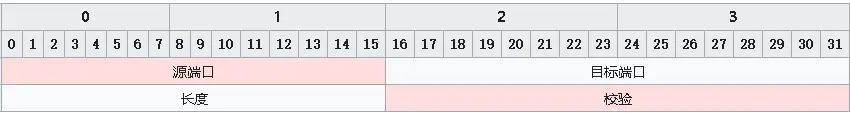

源端口和目的端口，端口号理论上可以有$2^{16}$这么多，因为它的长度是16bit，Length占用2个字节，标识UDP头的长度，包括首部长度和数据长度。可以有65535字节那么长，但是一般网络在传送的时候，一次一般传送不了那么长的协议（MTU），就只好对数据进行分片。

Checksum：校验和，包含UDP头和数据部分，这是一个可选的选项，并不是所有的系统都对UDP数据包加以校验和数据（相对TCP协议的必须来说），但是RFC中标准要求，发送端应该计算校验和。

UDP检验和覆盖UDP协议头和数据，这和IP的检验和是不同的，IP协议的检验和只是覆盖IP数据头，并不覆盖所有数据，UDP和TCP都包含一个伪首部，这是为了计算检验和而设置的。

伪首部甚至还包含IP地址这样的IP协议里面都有的信息，目的是让UDP两次检查数据是否已经正确到达目的地，如果发送端没有打开校验和选项，而接收端计算校验和有差错，那么UDP数据将会被丢掉，而不产生任何差错报文。

UDP和ARP之间的交互：当ARP缓存还是空的时候，UDP在被发送之前一定要发送一个ARP请求来获得目的主机的MAC地址，如果这个UDP的数据包足够大，大到IP层一定要对其进行分片的时候，想象中，该UDP数据包的第一个分片会发出一个ARP查询请求，所有的分片都会等到这个查询完成后再发送，事实上是如此吗？结果是，某些系统会让每一个分片都发送ARP查询，所有的分片都在等待，但是接收到第一个回应的时候，主机却只发送最后一个数据片，而抛弃了其他的，这样因为分片的数据不能被及时组装，接收主机将会在一段时间内将永远无法组装的IP数据包抛弃，并且发送组装超时的ICMP报文（大多数系统不产生这个差错），以保证接收主机自己接收端缓存不被那些永远得不到组装的分片充满。

### 如何用UDP实现可靠传输

首先，有了这个问题，联想到TCP是可靠传输的，直接用UDP模拟TCP确认的方式不就行了吗？可是既然如此为什么不直接使用TCP呢，首先我们需要知道TCP的缺点，而这些是否可以通过UDP实现可靠传输中改进这些缺点。

TCP缺陷：
- 升级TCP的工作很困难；
- TCP建立连接的延迟；
- TCP存在队头阻塞问题；
- 网络迁移需要重新建立TCP连接；

现在已经有基于UDP协议实现可靠传输协议的成熟方案了，QUIC协议。

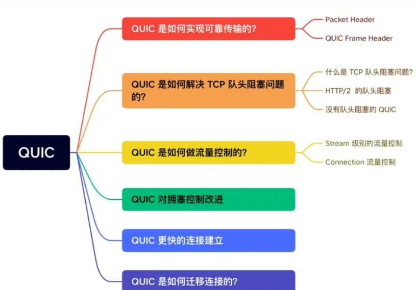

要基于UDP实现的可靠传输，那么就要在应用层下功夫，也就是要设计好协议的头部字段。拿http/3举例子，UDP报文头与HTTP消息之间，共有3层头部：

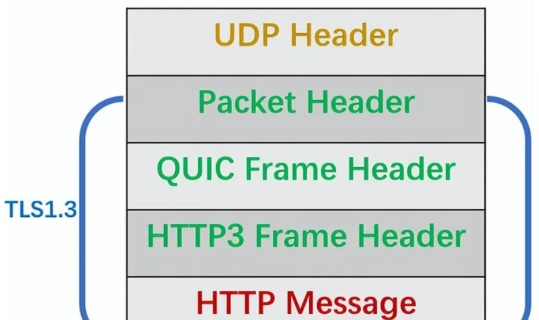

Packet Header：Packet Header首次建立连接时和日常传输数据时使用的Header是不同的。

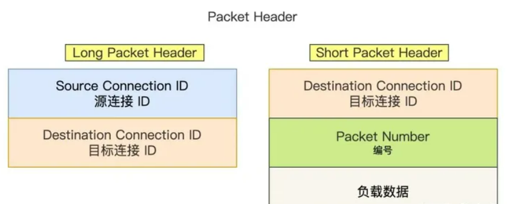

- Long Packet Header用于首次建立连接。
- Short Packet Header用于日常传输数据。

QUIC也是需要三次握手来建立连接的，主要就是为了确定连接ID。

建立连接时，连接ID是由服务器根据客户端的Source Connection ID字段生成的，这样后续传输时，双方只需要固定住Destination Connection ID（连接ID），从而实现连接迁移功能。所以，你可以看到日常传输数据Short Packet Header不需要在传输Source Connection ID字段了。

Short Packet Header中的Packet Number是每个报文独一无二的编号，它是严格递增的，也就是说Packet N丢失了，重传的Packet N的Packet Number已经不是N了，而是一个比N大的值。

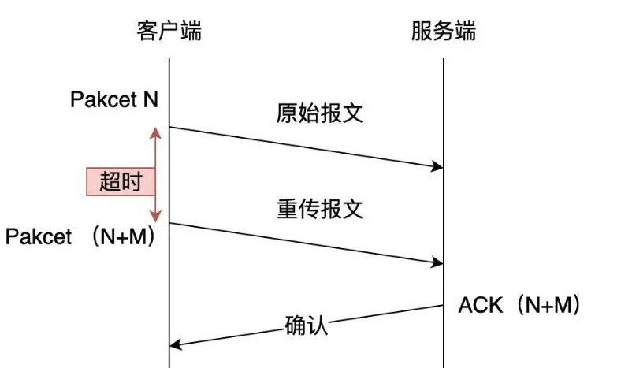

为什么要这样设计呢，TCP在重传报文的时候，序列号和原始序列号是一样的，也正是由于这个特性，引入了TCP重传歧义的问题。在计算RTT（往返时间）的时候，究竟是从原始报文开始计算，还是从重传报文开始计算呢。前者会使RTT变大，后者使RTT偏小。那么RTO计算就会不准确，导致重传的概率事件变大。

QUIC报文中的Packet Number是严格递增的，即使是重传报文，它的Packet Number也是递增的，这样就能更加精确计算出报文的RTT。

另外还有一个好处，QUIC使用Packet Number单调递增的设计，可以使数据包不再像TCP那样必须有序确认，QUIC支持乱序确认，当数据包Packet N丢失后，只要有新的已接收数据包，当前窗口就会继续向右移动。

待发送端超过一定时间没收到Packet N的确认报文后，会将需要重传的数据包放到待发送队列，重新编号比如数据包Packet N+M后重新发送给接收端，对重传数据包的处理和发送新的数据包类似，这样就不会因为丢包重传将当前窗口阻塞在原地，从而解决了队头阻塞问题。

所以Packet Number单调递增有两个好处：
- 可以更加精确的计算RTT，没有TCP重传歧义。
- 可以支持乱序确认，防止因为丢包重传将当前窗口阻塞在原地，而TCP必须按照顺序确认，丢包会导致窗口滑动。

QUIC Frame Header：一个Packet报文中可以存放多个QUIC Frame。
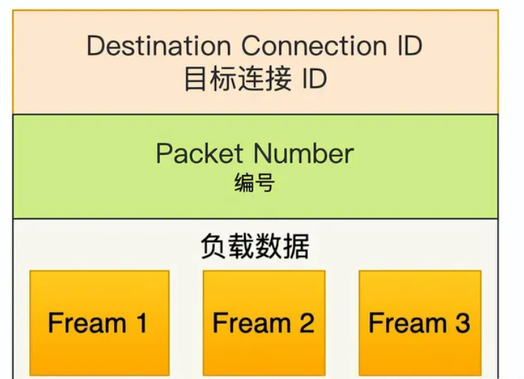

每一个Frame都有明确的类型，针对类型的不同，功能也不同，自然格式也不同，例如Stream类型的Frame格式，Stream可以认为就是一条HTTP请求：

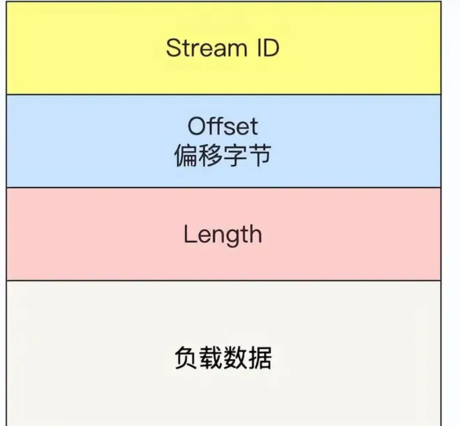

- StreamID：多个并发传输的HTTP消息，通过不同的StreamID加以区别
- Offset：类似TCP的Seq序号，保证数据的顺序性和可靠性。
- Length：指明Frame数据长度。

在前面介绍 Packet Header 时，说到 Packet Number 是严格递增，即使重传报文的 Packet Number 也是递增的，既然重传数据包的 Packet N+M 与丢失数据包的 Packet N 编号并不一致，我们怎么确定这两个数据包的内容一样呢？

所以引入 Frame Header 这一层，通过 Stream ID + Offset 字段信息实现数据的有序性，通过比较两个数据包的 Stream ID 与 Stream Offset ，如果都是一致，就说明这两个数据包的内容一致。

举个例子，下图中，数据包 Packet N 丢失了，后面重传该数据包的编号为 Packet N+2，丢失的数据包和重传的数据包 Stream ID 与 Offset 都一致，说明这两个数据包的内容一致。这些数据包传输到接收端后，接收端能根据 Stream ID 与 Offset 字段信息将 Stream x 和 Stream x+y 按照顺序组织起来，然后交给应用程序处理。
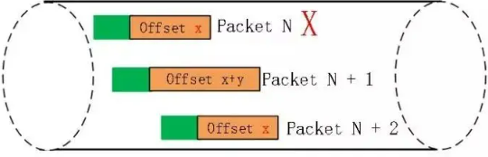

总的来说，QUIC通过单调递增的Packet Number，配合Stream ID与Offset字段信息，可以支持乱序确认而不影响数据包的正确组装，摆脱了TCP必须按顺序确认应答ACK的限制，解决了TCP因某个数据包重传而阻塞后续有待发送数据包的问题。

QUIC是如何解决TCP队头阻塞问题的呢？TCP队头阻塞主要分两个，一是发送窗口的队头阻塞，二是接收窗口的队头阻塞。

1. TCP发送出去的数据，都是需要按序确认，只有在数据都被按序确认之后，发送窗口才会向前移动。但是如果遇到某个数据报文丢失或者其对应的ACK报文在网络中丢失，会导致发送方无法移动发送窗口，这时就无法再发送数据，只能超时重传这个数据报文，直到收到重传报文的ACK。发送窗口才会移动，继续后面的发送行为。

2. 接收方收到的数据范围必须在接收窗口范围内，如果收到超过接收窗口范围的数据，就会丢弃该数据，比如接收窗口的范围是32~51字节，如果收到第52字节以上的数据就会被丢弃。接收窗口什么时候才能滑动？当接收窗口收到有序数据时，接收窗口才能往前滑动，然后那些已经接收并且被确认的「有序」数据就可以被应用层读取。但是，当接收窗口收到的数据不是有序的，比如收到第 33～40 字节的数据，由于第 32 字节数据没有收到， 接收窗口无法向前滑动，那么即使先收到第 33～40 字节的数据，这些数据也无法被应用层读取的。只有当发送方重传了第 32 字节数据并且被接收方收到后，接收窗口才会往前滑动，然后应用层才能从内核读取第 32～40 字节的数据。

## 应用层

虽然我们收到了传输层传来的数据，可是这些传过来的数据五花八门，有html格式的有MP4格式的，各种各样。

因此我们需要指定这些数据的格式规则，收到后才好解读渲染，例如最常见的HTTP数据包中，就会指定该数据包是什么格式的文件了。

## 网络设备和网络层次关系

- 物理层：中继器，集线器，网卡
- 数据链路层：网桥，二层交换机
- 网络层：路由器，三层交换机
- 传输层：防火墙
- 应用层：计算机，服务器
